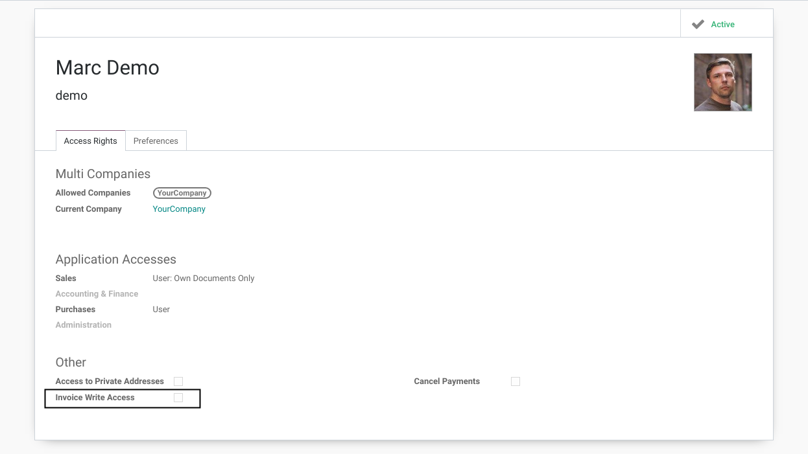
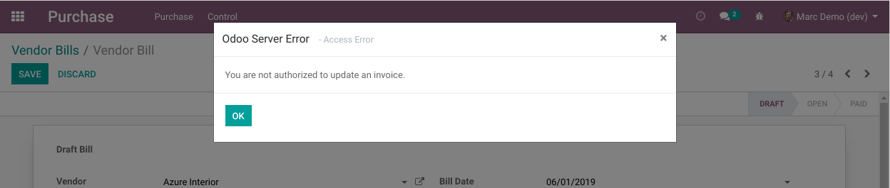

Invoice Write Access
====================
This module restricts the access to update/create/delete an invoice to a specific group.

Context
-------
In vanilla Odoo, any member of ``Sale / User`` or ``Purchase / User`` is allowed to update/create/delete an invoice.

How The Module Works
--------------------
A new technical group ``Invoice Write Access`` is added.

The group ``Accounting / Billing`` inherits this group.
It is not possible to have ``Accounting / Billing`` without ``Invoice Write Access``.

Hidden Buttons
~~~~~~~~~~~~~~
The buttons to create an invoice are hidden on the purchase and sales order for non-members of 
the group ``Invoice Write Access``. See modules ``invoice_write_access_sale`` and ``invoice_write_access_sale``.

Extended Security Rules
~~~~~~~~~~~~~~~~~~~~~~~
The module `base_extended_security <https://github.com/Numigi/odoo-base-addons/tree/12.0/base_extended_security>`_
is used to prevent non-members of the new group to create/update/delete an invoice.

This mecanism prevents user to create an invoice through the web interface, but does not impact
the internal behavior of Odoo. This limits the risk to create side effects related to modifying native Odoo ACL.

For example, if an unauthorized user attemps to create an invoice, the following message will be displayed:

Contributors
------------
* Numigi (tm) and all its contributors (https://bit.ly/numigiens)
