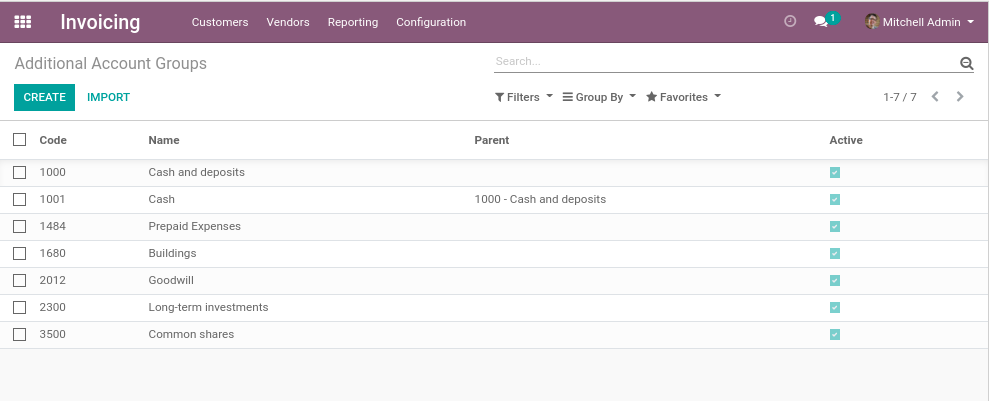
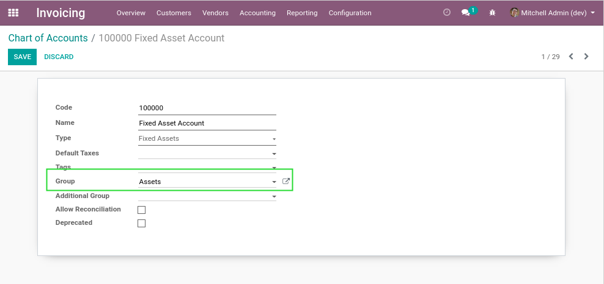
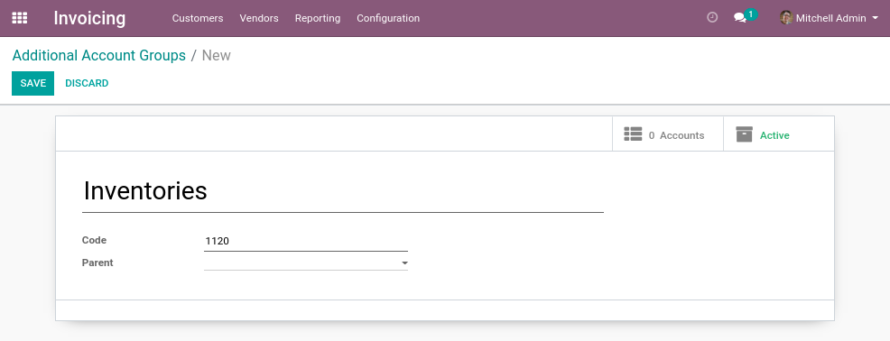
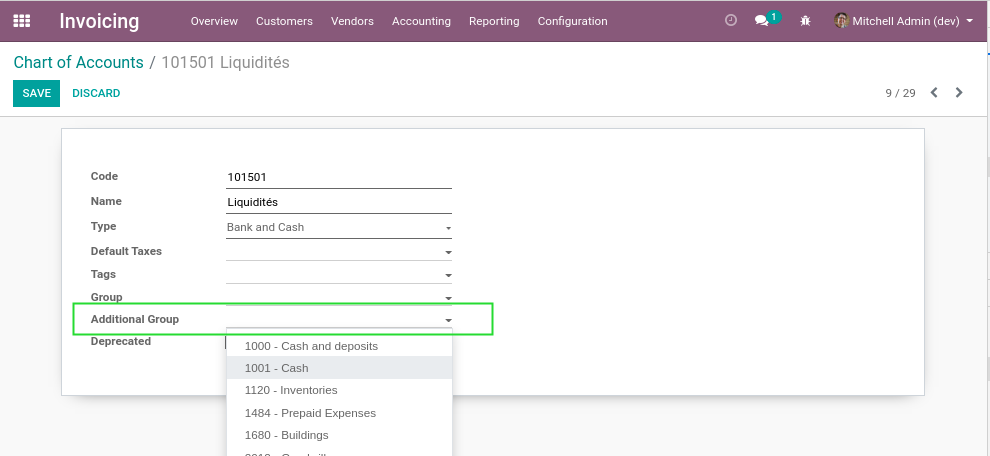
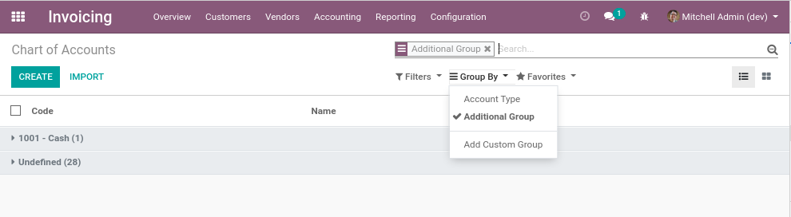
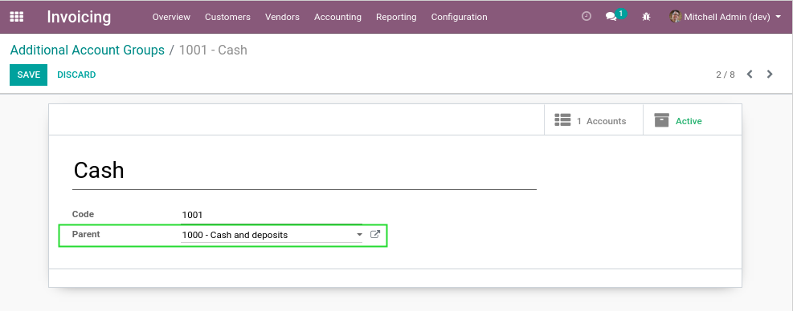

Account Additional Group
========================

.. contents:: Table of Contents

Summary
-------
This module adds a second referencial of ``Group of Account``.

Context
-------

Issues With Native Groups of Account
~~~~~~~~~~~~~~~~~~~~~~~~~~~~~~~~~~~~
In vanilla Odoo, you may define groups of account.

These groups can be used to build accounting reports.

One problem with these is that Odoo S.A changes this model from one major version to another.

For example, in version 14.0, Odoo chose that these groups should be computed based on the code of
accounts instead of manually assigned to each account.

Two Different Structures
~~~~~~~~~~~~~~~~~~~~~~~~
Also, there is a requirement to have a second structure of groups of accounts.

One use case is to implement reports for the CRA based on the `General Index of Financial Information <https://www.canada.ca/en/revenue-agency/services/tax/businesses/topics/corporations/corporation-income-tax-return/completing-your-corporation-income-tax-t2-return/general-index-financial-information-gifi.html>`_.

Usage
-----
Under ``Accounting / Configuration``, I notice a new menu ``Additional Groups``.

.. image:: static/description/additional_group_menu.png

I create an additional group of account.

In the form view of an account, I can assign an additional group.

In the list view of accounts, I can search and group by additional group.

Recursivity
-----------
A group of account can have a parent.

In such case, an account associated to the child group is also be associated to the parent group.

Reports
-------
This module does not define how additional groups are integrated with accounting reports.

This depends on what reporting engine is used to generate your reports.

Contributors
------------
* Numigi (tm) and all its contributors (https://bit.ly/numigiens)
