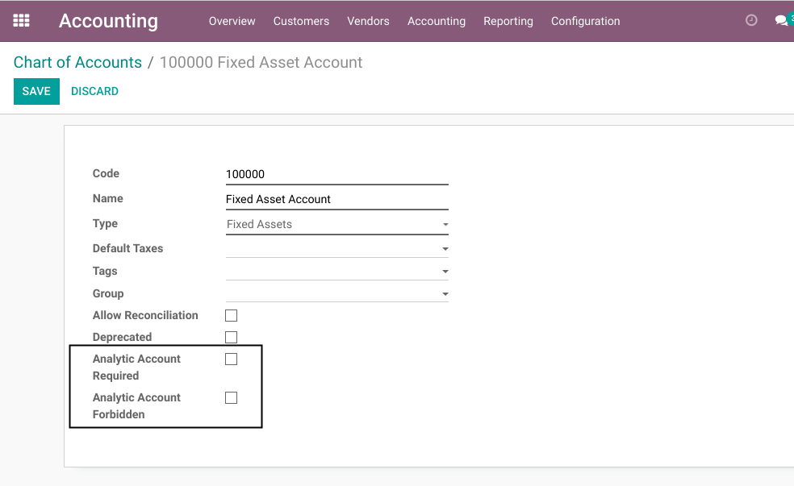
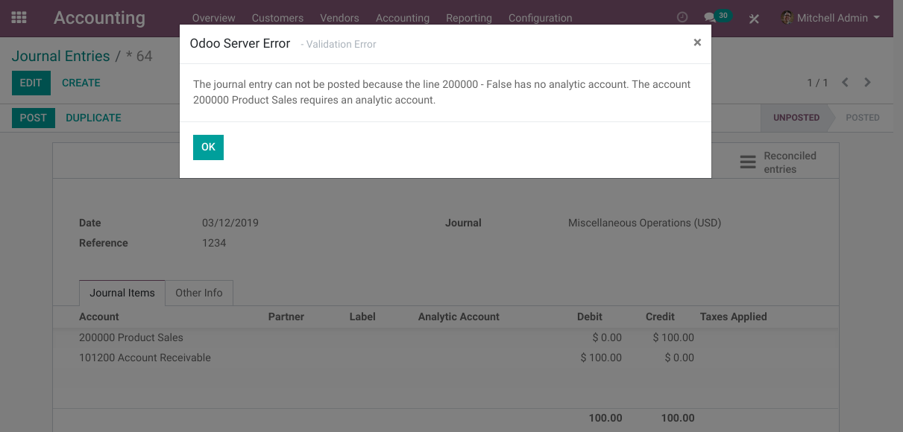
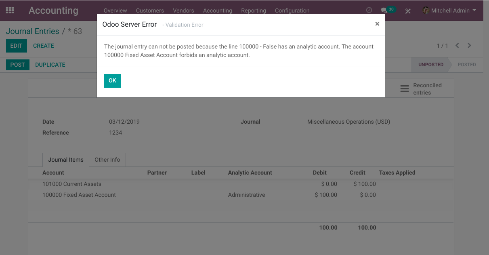

Account Analytic Required / Forbidden
=====================================
This module allows to make the analytic account required or forbidden when posting entries in a given GL account.

Usage
-----
As member of the group `Accounting / Adviser`, I go to the form view of a journal account.

I notice 2 new fields `Analytic Account Required` and `Analytic Account Forbidden`.

When checking `Analytic Account Required`, if the analytic account is absent
on an entry line with this account, a blocking message appears when posting the entry:

When checking `Analytic Account Forbidden`, if an analytic account is combined with this account on
a journal entry line, a blocking message appears when posting the entry:

Contributors
------------
* Numigi (tm) and all its contributors (https://bit.ly/numigiens)
