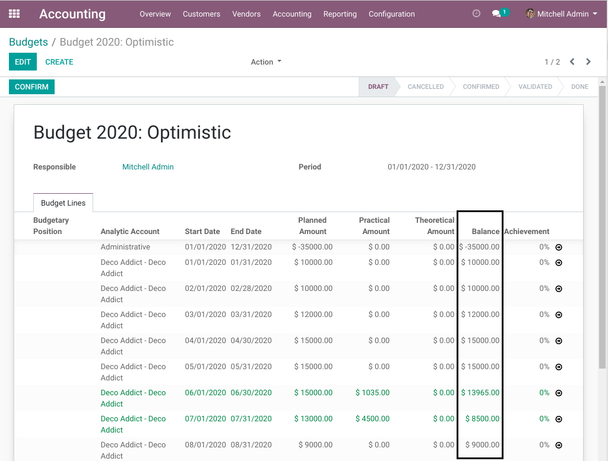
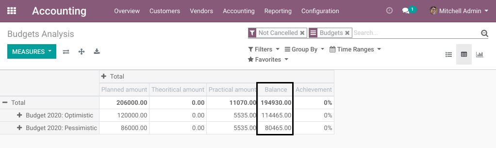

Account Budget Balance
======================
This module adds a `Balance` column to the budget lines.

The field is computed as follow:

..

    Planned Amount - Practical Amount = Balance Amount

The field is available in the `Budget Analysis` report.

Contributors
------------
* Numigi (tm) and all its contributors (https://bit.ly/numigiens)
