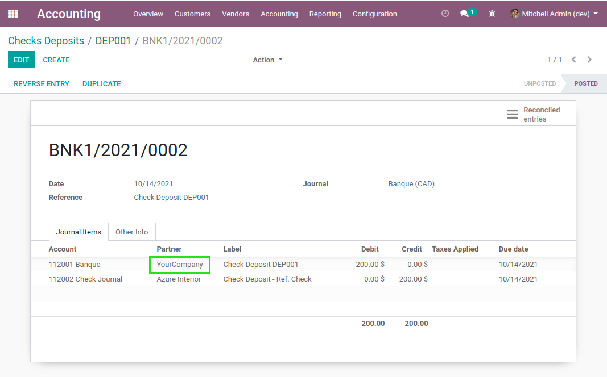
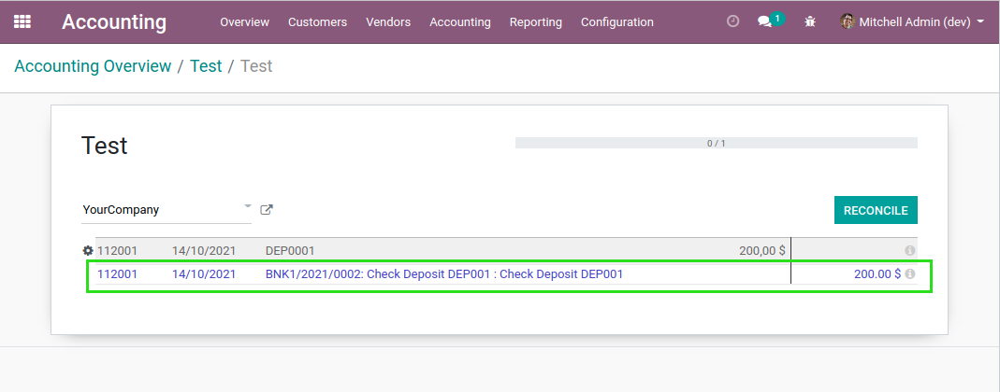

Account Check Deposit Enhanced
==============================

.. contents:: Table of Contents

Context
-------
The module `account_check_deposit <https://github.com/OCA/account-financial-tools/tree/12.0/account_check_deposit>`_ allows to process check deposits.

The module comes with a limitation.

When recognizing the deposit of a check, the debit part of the journal entry has no partner on it.

When reconciliating the journal item with the bank statement, the line can not be found.
To be able to reconcile it, both the bank statement line and the journal item must
have a partner.

Overview
--------
After installing this module, when processing a check deposit, the credit part of the journal
entry has the partner related to the company.

When reconciling with the bank statement, the journal entry is proposed by the system.

Contributors
------------
* Numigi (tm) and all its contributors (https://bit.ly/numigiens)
