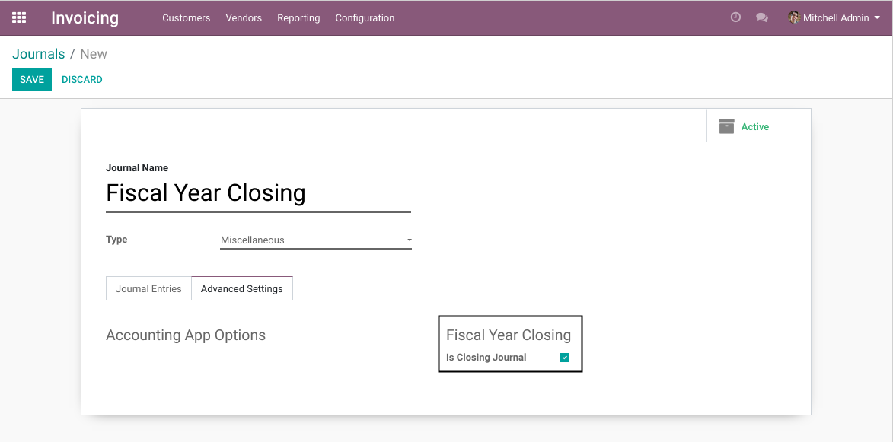
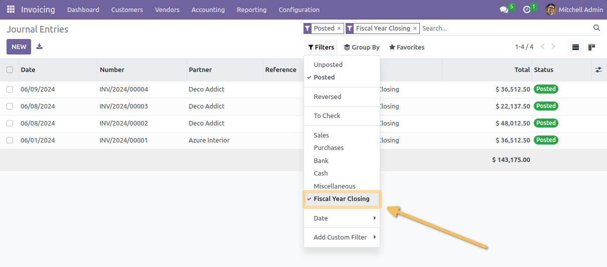
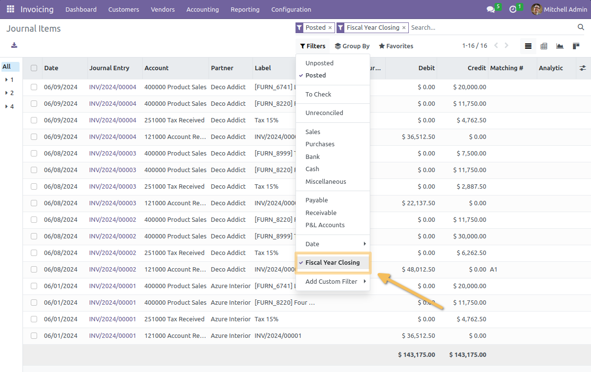

=======================
Account Closing Journal
=======================

.. contents:: Table of Contents

Overview
--------
This module allows to define an accounting journal as ``Closing Journal``.

When checked, any journal entry reported in the journal is flagged as a ``Closing Entry``.

Module Design
-------------
The module adds a boolean field ``is_closing`` on account.journal
and a related ``is_closing`` field on account.move and account.move.line.

These boolean fields can be used to exclude entries from the ``Income Statement``.

Generating Closing Entries
--------------------------
This module does not define an automatted way to generate closing entries.

You must either create this entry manually at the end of your fiscal year,
or define another module to generate these entries for you.

Contributors
------------
* Numigi (tm) and all its contributors (https://bit.ly/numigiens)
