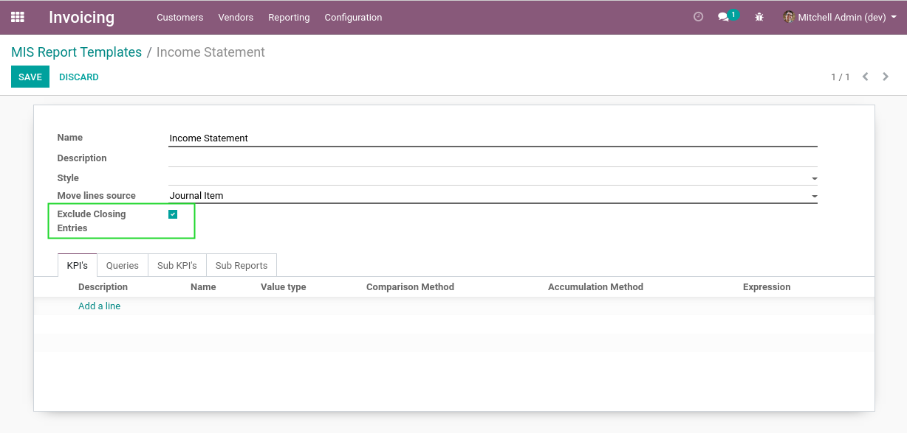

Account Closing Journal / Mis Builder
=====================================
This module is binding between account_closing_journal and `mis_builder <https://github.com/OCA/mis-builder>`_.

.. contents:: Table of Contents

In the configuration of a Mis Report, I notice a new checkbox ``Exclude Closing Entries``.

When this box is checked, all journal entries related to a closing journal are automatically
excluded from the report.

Contributors
------------
* Numigi (tm) and all its contributors (https://bit.ly/numigiens)

More information
----------------
* Meet us at https://bit.ly/numigi-com
