Account Closing Wizard
=======================

.. contents:: Table of Contents

Context
-------
The module ``account_closing_journal`` defines a simple mecanism to record closing journal entries.

Closing entries can be easily excluded from the ``Income Statement`` using a simple domain filter
``[('is_closing', '=', False)]``.

It does not define a mecanism to help generate these journal entries.

Usage
-----
I go to the form view of an account. I notice a new checkbox ``Default Retained Earnings Account``.

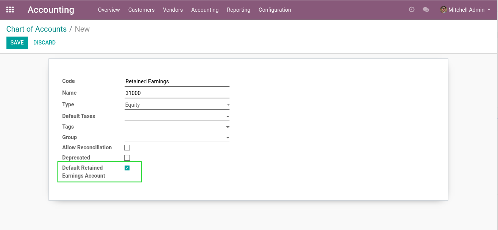

This box can be checked for only one account per company.

If checked, this account is used as the main account for closing entries.

I go to ``Accounting / Accounting / Actions / Fiscal Year Closing``.

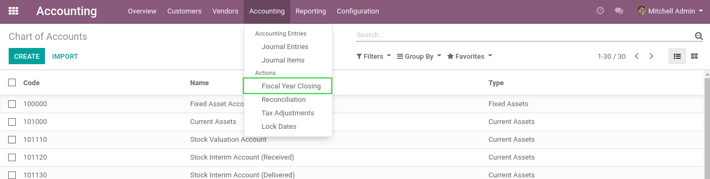

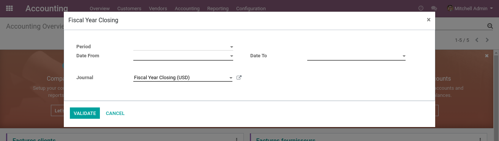

I select the period to close and the closing journal to use.

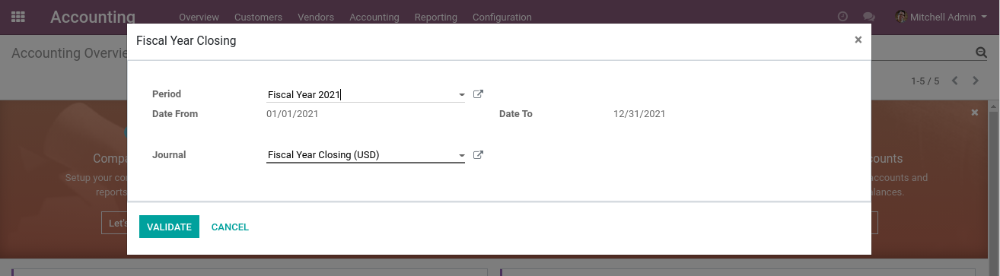

Only a journal defined as ``Closing Journal`` can be selected.

I click on the ``Confirm`` button.

A new journal entry is opened.

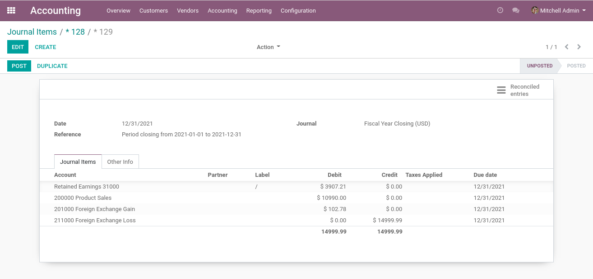

I notice that the entry has one line per expense and revenue account.

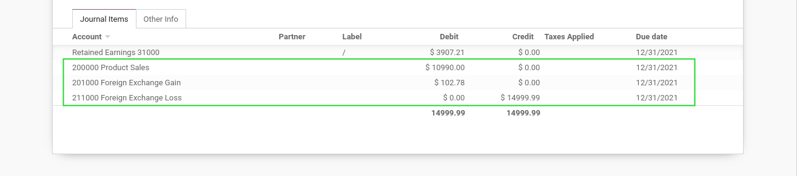

The counterpart is the default retained earnings account.

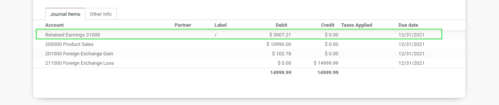

I post the journal entry.

.. image:: static/description/account_move_posted.png

Running the Wizard Twice
------------------------
After posting the closing entry, if you have extra journal entries to post in the closed period,
you do not need to revert the closing entry.

You just need to execute the wizard a second time.
The previous closing entry will be considered when computing the new entry.

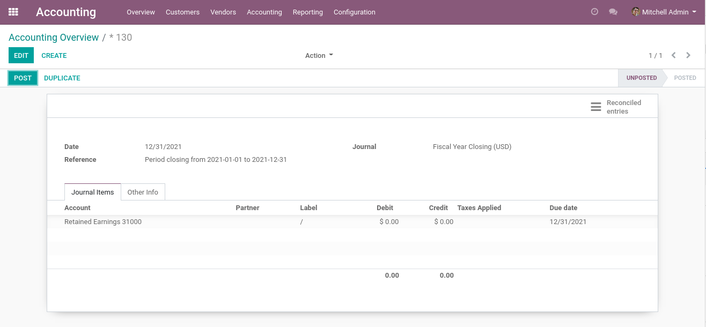

Blocking from closing fiscal year
---------------------------------
As a user using the Numigi account closing wizard, I have a blocking error message preventing me from closing my fiscal year if an accounting document with draft status is recorded in my company with a date equal to or prior to the end date of the fiscal year to be closed.

I have an unposted journal entry with a selected date and then I go to the menu to close a fiscal year.

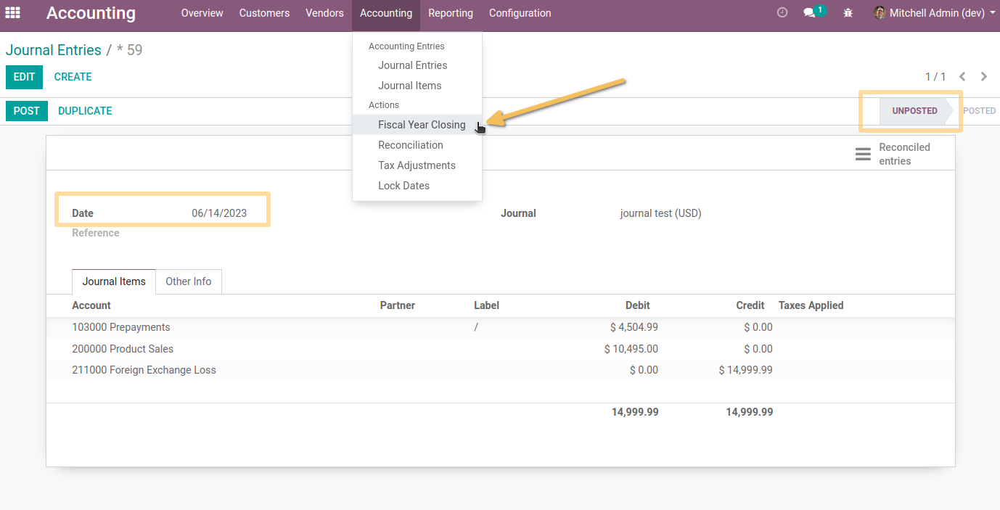

I have an end date that is superior to the unposted journal entry.

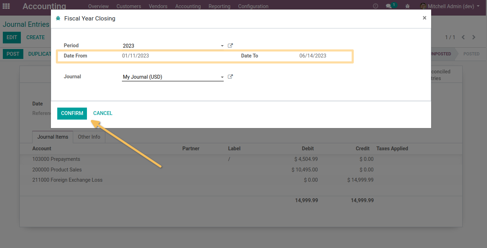

I see an error preventing me to close the fiscal year.

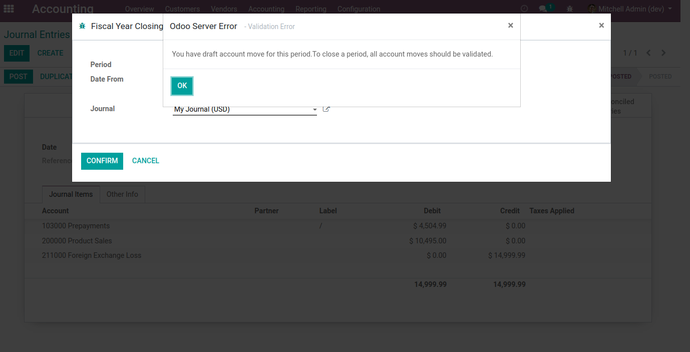

Contributors
------------
* Numigi (tm) and all its contributors (https://bit.ly/numigiens)
