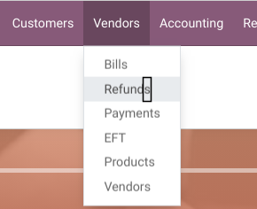
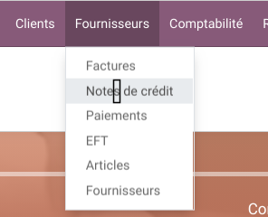

Canada French Accounting Labels
===============================
This module sanitizes the labels of the accounting application for the french Canada language.

Odoo's french terms are European terms. In Quebec, some important terms are different.
This is at some point that people get confused.

Here is an overview of the changed terms.

* Avoir -> Note de crédit
* Balance âgée -> Âge des comptes
* Lettrage -> Conciliation bancaire

The issue with these translations is that they appear undreds of times in Odoo PO files of different modules.
Updating and maintaining each of these translations would require a major and constant effort.

Translations to update can be as specific as the following:

..

	Compte utilisé sur les lignes de taxes des `avoirs`. Laissez vide pour utiliser le compte de dépenses.

Menu Items Adjustments
----------------------
The missing `s` is added to the menu item `Accounting / Vendors / Refund`.

Contributors
------------
* Numigi (tm) and all its contributors (https://bit.ly/numigiens)
