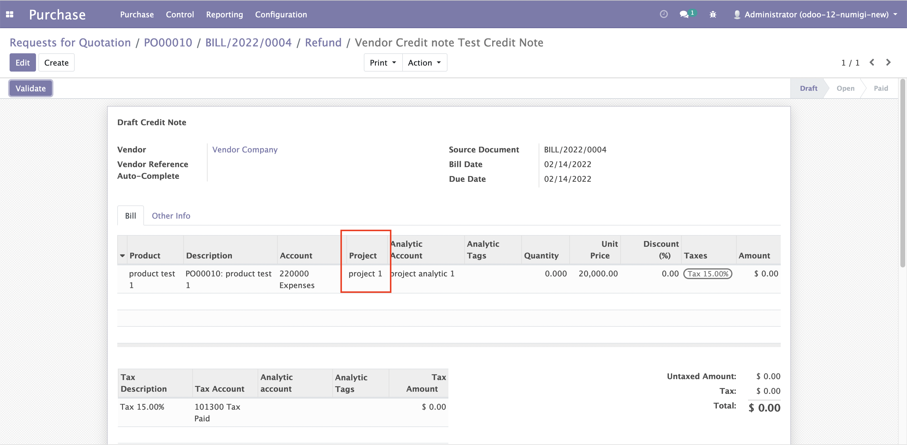

Account Invoice Project Purchase
================================
Description
-----------

This module will add Project field on Purchase Order Line

When Project is selected on Purchase Line, Analytic Account is populated from Analytic Account of Project

When Vendor Bill is created from Purchase, Project on Invoice Line is automatically populated from Purchase Line.

On Vendor Bill Form, add Project Field on vendor bill line

When Project is selected on Vendor Bill Line, Analytic Account is populated from Analytic Account of Project

When Project is selected on Credit Note Vendor Bill, Analytic Account is populated from Analytic Account of Project

When Credit Note is created from Vendor Bill, Project on Credit Note Invoice Line is automatically populated from Vendor Bill Line

Configuration
-------------

No configuration required apart from module installation.

Contributors
------------
* Numigi (tm) and all its contributors (https://bit.ly/numigiens)
* Komit (https://komit-consulting.com)

More information
----------------
* Meet us at https://bit.ly/numigi-com
