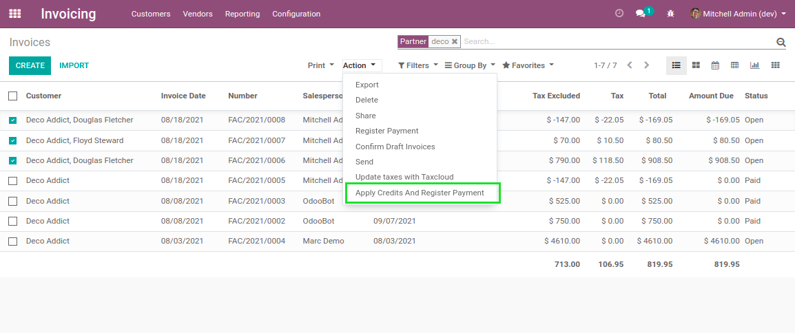
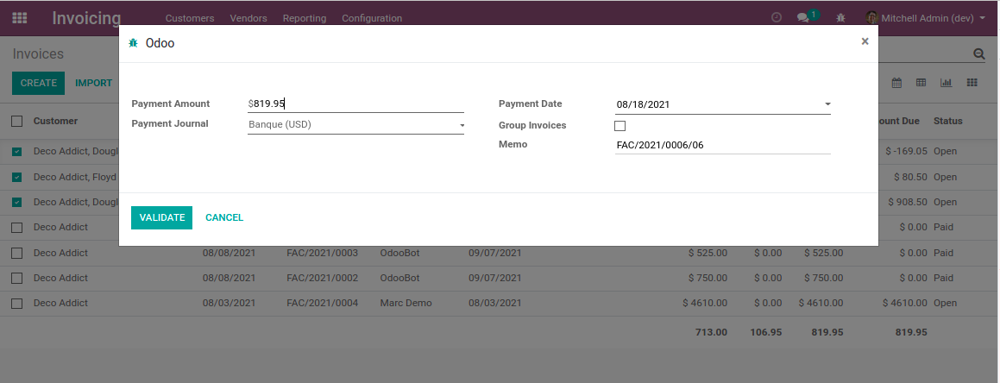

Account Invoice Unified Payment
===============================

.. contents:: Table of Contents

Context
-------
In vanilla Odoo, since version 12.0, when registering a payment for invoices,
it is not possible to include refunds.

The reason is mostly technical.

In Odoo, a negative reconciliation between two journal items is not possible.
You must match a debit with a credit.

Therefore, it is not possible to include a credit note when paying invoices.

Until version 11.0, it still could be acheived.
Instead of a negative matching between the payment and the credit note,
the credit note was arbitrarily matched with one (or multiple) invoice(s).

This feature was confusing for most companies.
However, for some companies that did not require a precise matching between
invoices and payment, it helped do the reconciliation faster.

In version 12.0, this workaround is blocked by a constraint when registering the payment.

Overview
--------
The following example is done with receivable accounts. The behavior is the same for payables.

After installing this module, a new action is available in list view of invoices and refunds.

Immediately after clicking on the menu item, the selected invoices and refunds are
reconciled together.

Then, a payment wizard is open. It allows to register the payment for the residual amount.

Constraints
-----------
Before the wizard is opened, a series of constraints are checked against the invoices and credit notes.

* The open balance of the invoices must be greater than the open balance of the credit notes.
* All invoices and credit notes must be open.
* All invoices and credit notes must have the same:

    - Currency
    - Commercial Partner
    - Payable / Receivable Account

Known Issues
------------

Reconciliation
~~~~~~~~~~~~~~
In case you are paying multiple invoices and refunds, each refund is arbitrarily matched
with an invoice.

Therefore, some invoices might not be matched with the registered payment.

This module is therefore not appropriate if you need to control exactly which invoices are matched with
the payment.

Credit Notes
~~~~~~~~~~~~
When the wizard is opened, if you click on ``Cancel``, the system does not unreconcile
the credit notes and invoices.

The credit notes will remain in the status ``Paid``.

Contributors
------------
* Numigi (tm) and all its contributors (https://bit.ly/numigiens)
