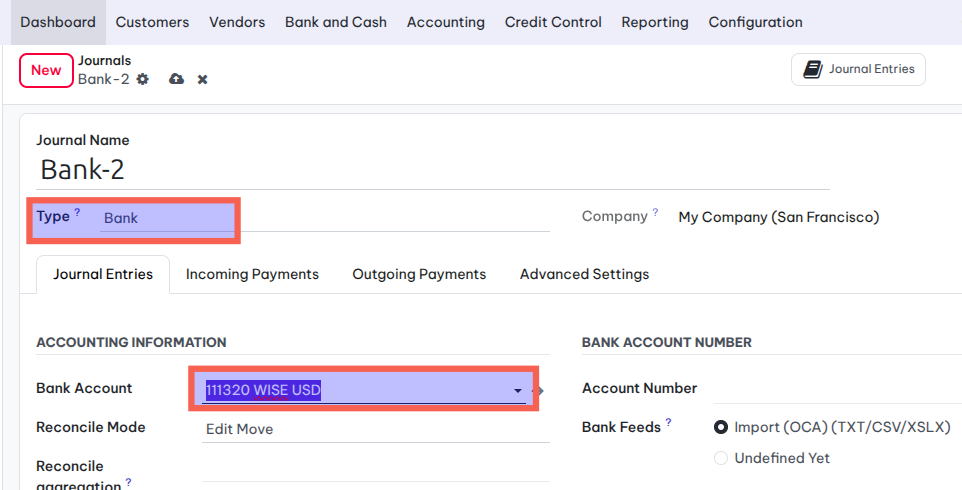
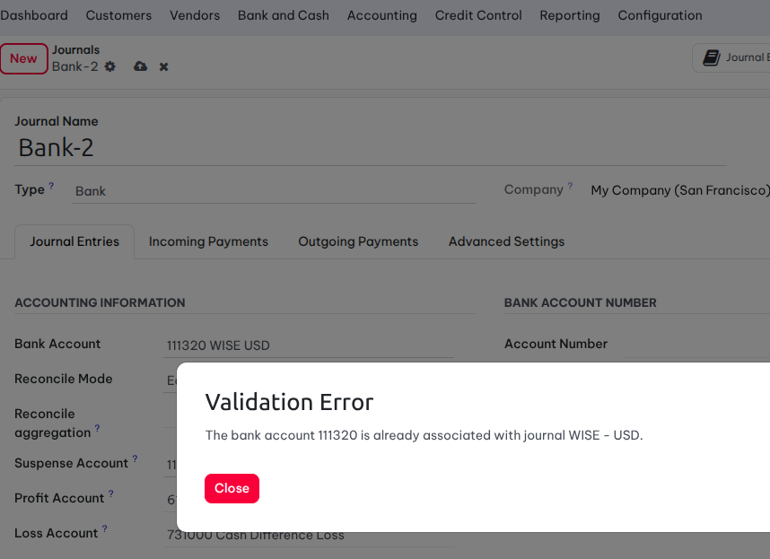
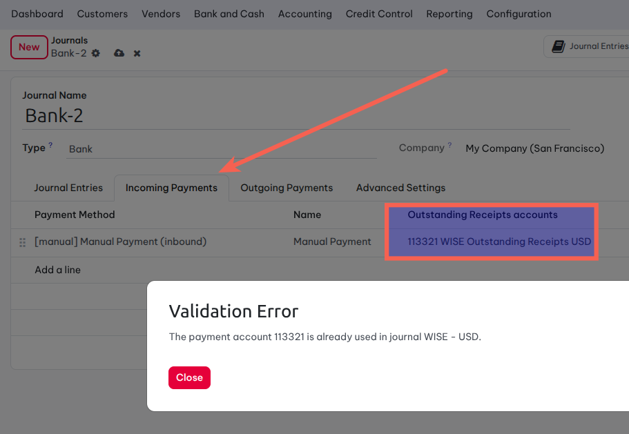
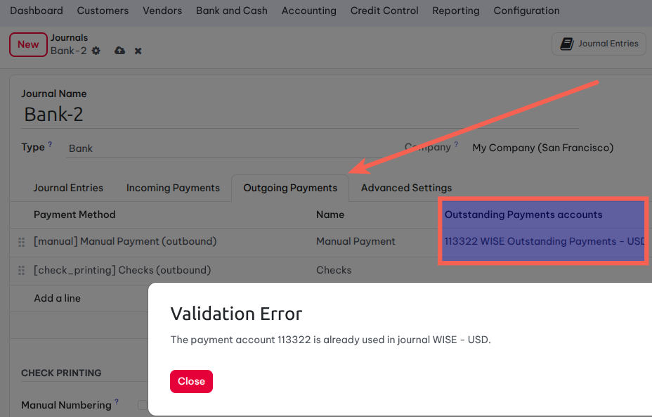

================================
Account Journal Bank Exclusivity
================================

.. contents:: Table of Contents

Context
-------
In vanilla Odoo, nothing prevents two bank journals from sharing the same
default account, the same payment-method suspense account, or (in ``keep``
reconciliation mode) the same suspense account. This leads to ambiguous
reconciliation and reporting.

Summary
-------
This module adds validation constraints on ``account.journal`` and
``account.payment.method.line`` to guarantee the uniqueness and exclusivity
of accounts attached to bank journals:

* A given account can be the ``default account`` of at most one bank journal.
* A given account can be the ``payment account`` of payment method lines on
  at most one bank journal.
* In ``keep`` reconciliation mode, the ``suspense account`` of a bank journal
  must be exclusive to that journal.
* Once transactions exist on a ``keep``-mode bank journal, its suspense
  account can no longer be modified.

Before installing on an existing database
-----------------------------------------
The module does **not** archive, rename or alter existing journals. Before
installing on a database that already contains bank journals, please:

1. Identify bank journals that share the same default account, the same
   payment-method suspense account, or (in ``keep`` mode) the same suspense
   account.
2. Resolve those overlaps according to your accounting policy — typically by
   reassigning accounts on the affected journals.

If duplicates remain at install time, the module will **not** block
installation. Instead, a post-install hook will:

* Log a warning per duplicate group in the server log.
* Send an Inbox notification to the admin partner listing every affected
  journal, so the situation can be reviewed and corrected.

The new constraints only block **future** modifications, so legacy data is
preserved as-is until you address it manually.

Usage
--------------------------------------------
When configuring a bank-type journal, the system prevents users from using a bank account that is already linked to another journal.

Additionally, the system enforces uniqueness for Outstanding Receipts account 

and outgoing payments.

Contributors
------------
* Numigi (tm) and all its contributors (https://bit.ly/numigiens)