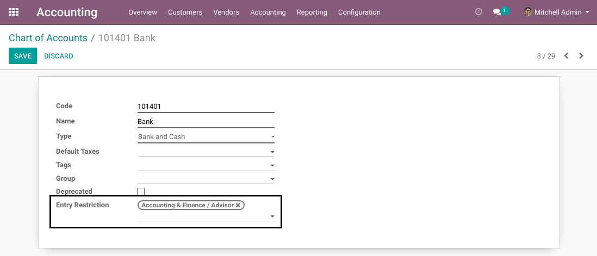
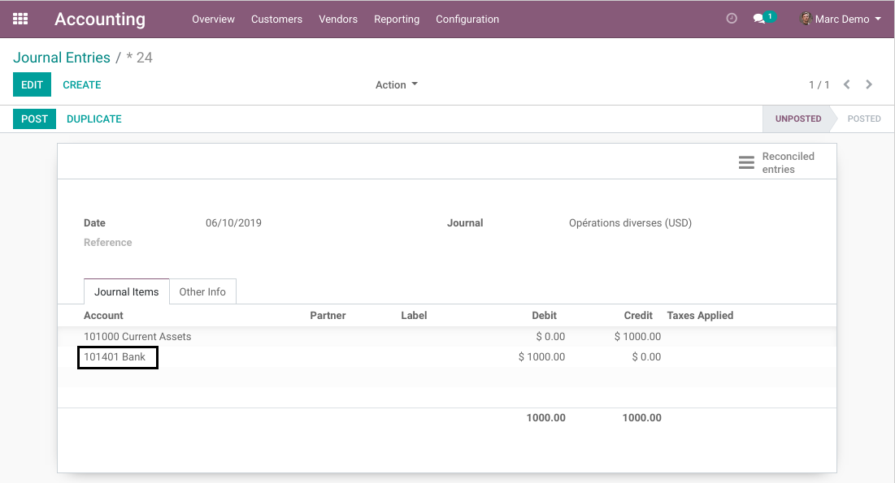
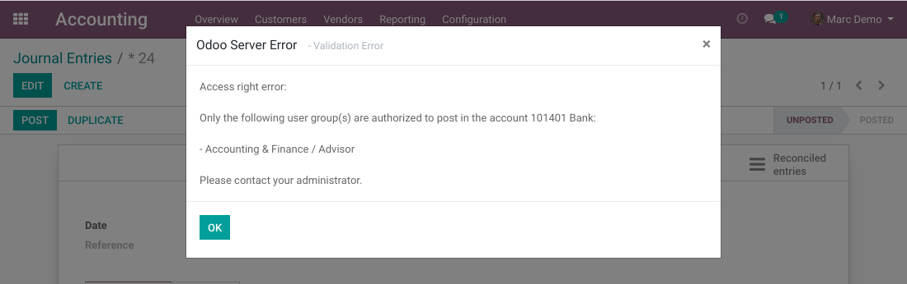

Account Manual Entry Restricted
===============================

.. contents:: Table of Contents

Context
-------
In vanilla Odoo, a user with basic access may create and post journal entries manually.

As accountant / controller, you might want to keep controle over some specific accounts.
You do not want people to accidentaly write in these accounts.

Summary
-------
This module adds a field `Entry Restriction` on accounts.

This field allows to select one or many user groups.

These groups are allowed to post manual journal entries with this account.
Other groups are forbidden.

If the field is empty, then no restriction is applied on this account.

Automatic Entries
~~~~~~~~~~~~~~~~~
These restrictions do not apply for journal entries generated automatically
for invoices, payments, expenses, etc.

Usage
-----
As member of the group `Accounting / Advisor`, I go to the form view of an account.

I select the group `Accounting / Advisor`.

Manual Entries
­~~~~~~~~~~~~~~
As member of the group `Accounting / User`, I create a new journal entry with the restricted account.

When I click on `Post`, a blocking message appears.

Contributors
------------
* Numigi (tm) and all its contributors (https://bit.ly/numigiens)
