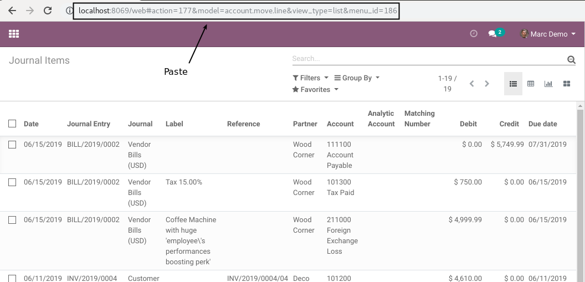

Account Move Access
===================
This module restricts the access to journal items (account move lines).

Context
-------
In vanilla Odoo, any member of the group ``Employee`` can see all journal items for his/her company.

The employee only has to know the right URL (or query via RPC).

To prove this, as admin, I copy the URL of journal entries:

As a basic user, I paste the URL:

The exact same list is displayed.

Summary
-------
After installing this module, only the members of the group ``Accounting / Billing`` (and higher accounting access)
have access to account move lines.

After installing the module, as a basic user, if I go to the URL of journal items, I find an empty list:

If I paste the URL of the form view of a journal item, I get a blocking error message and I am redirected to the main menu:

.. image:: static/description/employee_journal_item_form_after.png

How The Module Works
--------------------
The module does not impact the internal mechanism of Odoo.

It adds extra security rules that are applied at the HTTP controller level.
See module `base_extended_security <https://github.com/Numigi/odoo-base-addons/tree/12.0/base_extended_security>`_ for more details.

Contributors
------------
* Numigi (tm) and all its contributors (https://bit.ly/numigiens)
