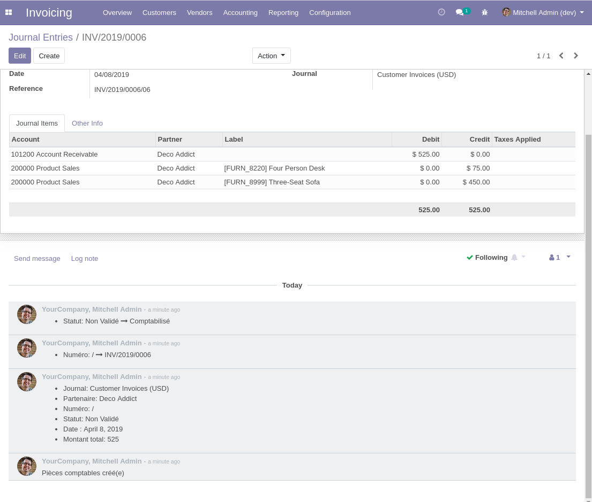
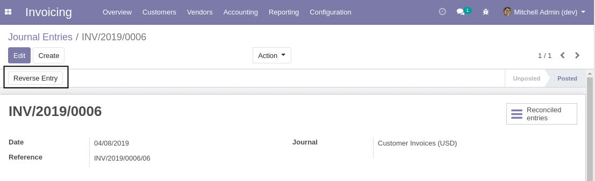
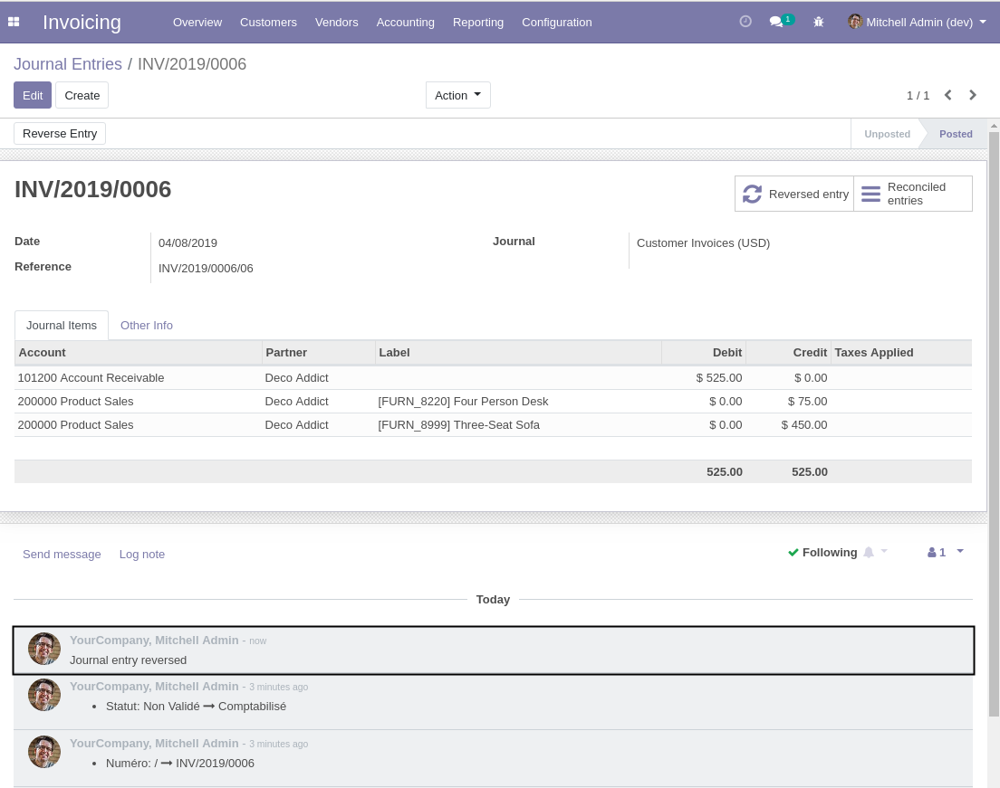

Account Move Chatter
====================
This module adds the chatter on journal entries.

It also adds the tracking of the following fields:

* Date
* Reference
* Journal
* State
* Partner
* Total Amount (debit / credit)

Journal Entry Reversal
----------------------
When reversing a journal entry, an internal note is logged in the chatter of the origin journal entry.

Contributors
------------
* Numigi (tm) and all its contributors (https://bit.ly/numigiens)
