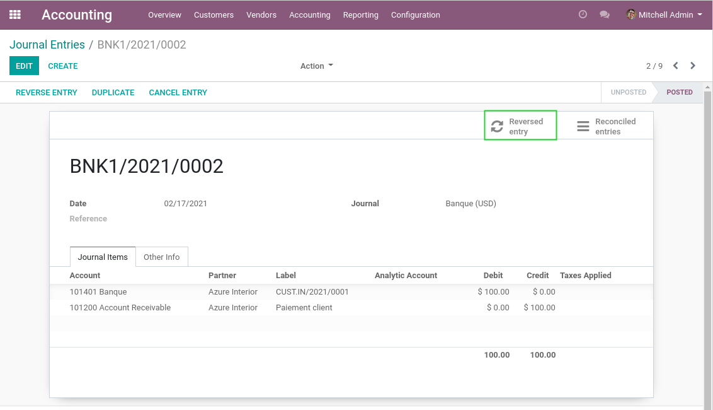
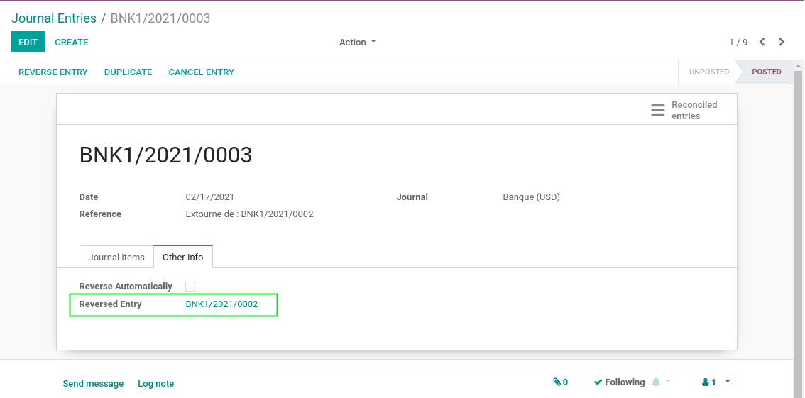

Account Move Reversed Entry
===========================

Context
-------
In vanilla Odoo, in the form view of a reversed journal entry, a smart button
allows to see the related reversal entry.

However, on the form view of the reversal entry,
there is only a textual reference to the origin entry.

.. image:: static/description/reversal_entry_before.png

Overview
--------
After installing this module, on the form view of the reversal entry,
a link allows to navigate to the origin entry.

Contributors
------------
* Numigi (tm) and all its contributors (https://bit.ly/numigiens)

More information
----------------
* Meet us at https://bit.ly/numigi-com
