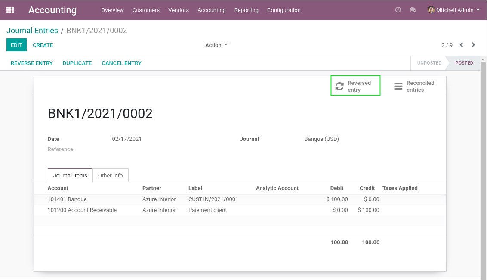
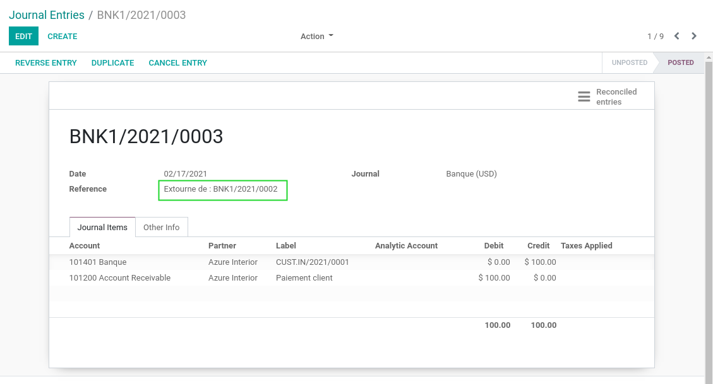
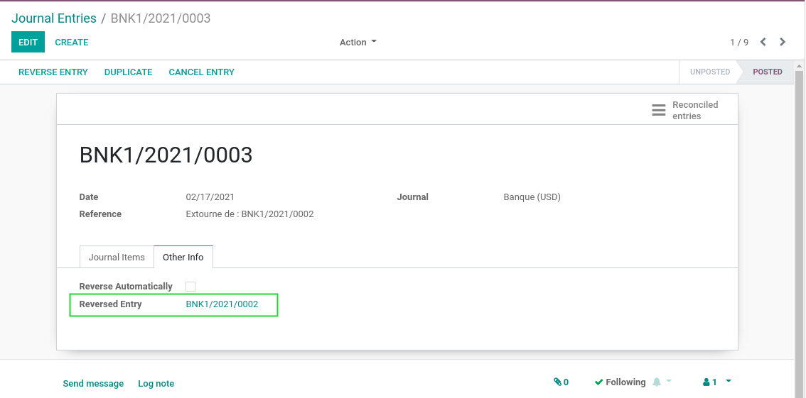

Account Move Reversed Entry
===========================

Context
-------
In vanilla Odoo, in the form view of a reversed journal entry, a smart button
allows to see the related reversal entry.

However, on the form view of the reversal entry,
there is only a textual reference to the origin entry.

Overview
--------
After installing this module, on the form view of the reversal entry,
a link allows to navigate to the origin entry.

Contributors
------------

The `Numigi <https://numigi.com/r/home>`_ team is the contributor to this project. We help Quebec companies implement Odoo and Konvergo ERP.

