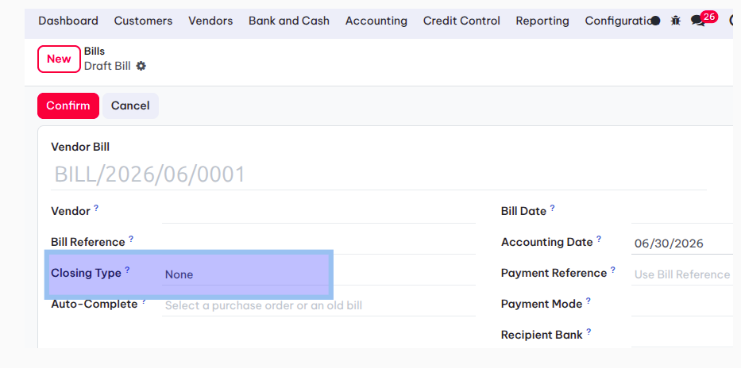
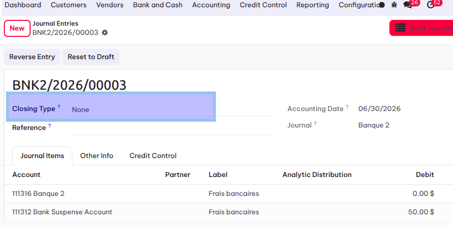
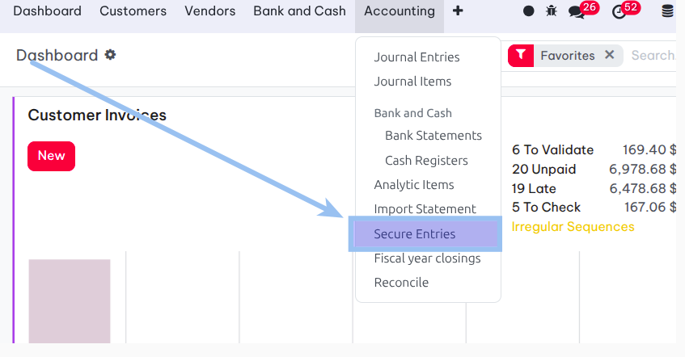
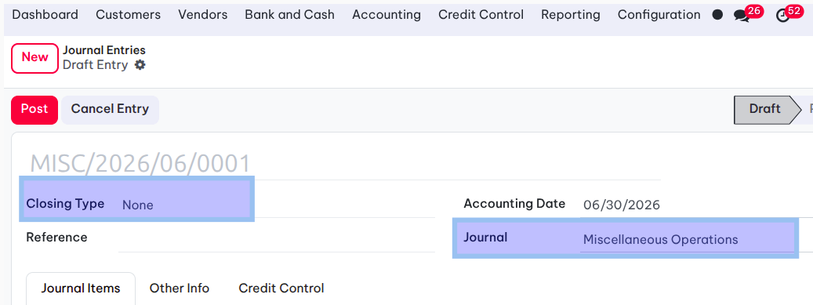
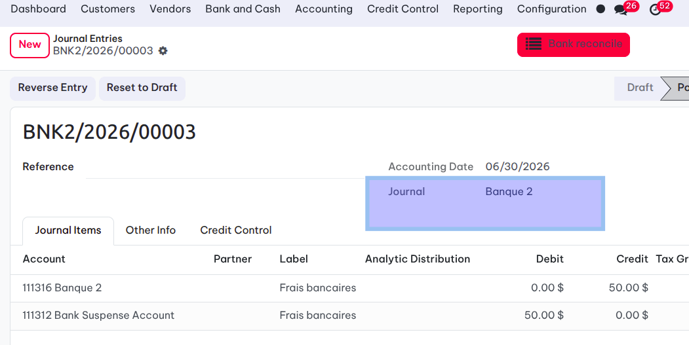
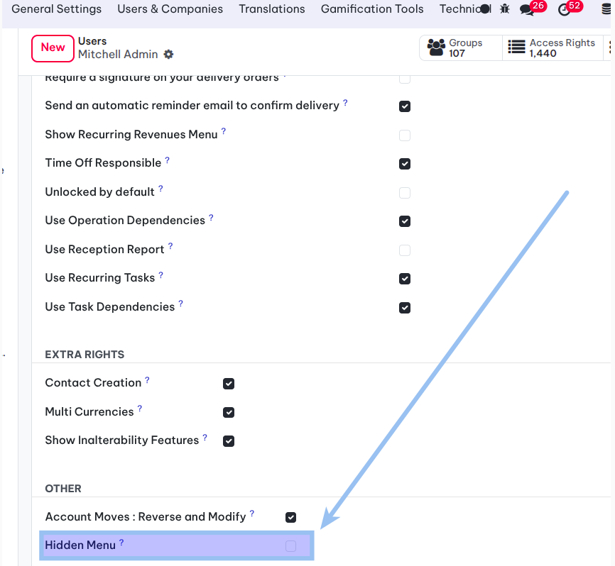

Account Move Secure
========================

.. contents:: Table of Contents

Summary
-------
This module allow to : 

* hide the visibility of the field ``closing_type`` on account moves

* Hide menu Secure entries

Context
-------

To secure accounting entries and prevent data entry errors, we need to restrict the visibility
 of the field ``closing_type`` on journal entries  and remove access to the Secure Entires menu.

Usage
-------
Upon insalling this module, the ``closing_type`` field will be  hidden by default for all journal types except for `Miscellaneous Operations`

When the journal  is modified, the field will be hidden.

To hide the 'Secure Entries' menu, a new group is created with a 'False' value by default. 

This hides the menu for all users.

Once this group is assigned to a user, he will be able to see the 'Secure Entries' menu.
