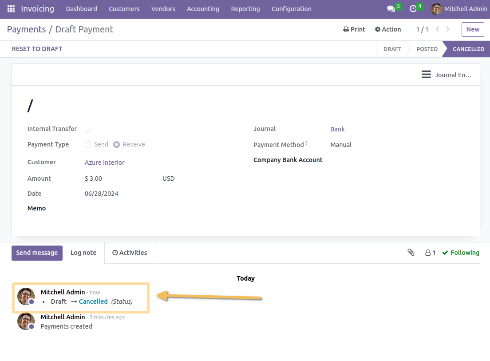

====================
Payment Cancel Group
====================

.. contents:: Table of Contents

Context
-------
In vanilla Odoo, when the module account_cancel is installed, users with basic accounting access
are able to cancel a payment (if authorized on the journal).

.. image:: static/description/payment_cancel_button.png

Summary
-------
This module adds a user group allowed to cancel payments.

.. image:: static/description/user_form.png

The `Cancel` button on payments is only displayed for members of this group.

Known Issues
~~~~~~~~~~~~
As of Odoo version 14.0, the cancellation of payments passes through the status ``Draft``.

In other words, a posted payment can be reset to draft, then it can be cancelled.

Because of this new behavior, the module now restricts both ``Reset To Draft`` and ``Cancel`` buttons.

Contributors
------------
* Numigi (tm) and all its contributors (https://bit.ly/numigiens)
