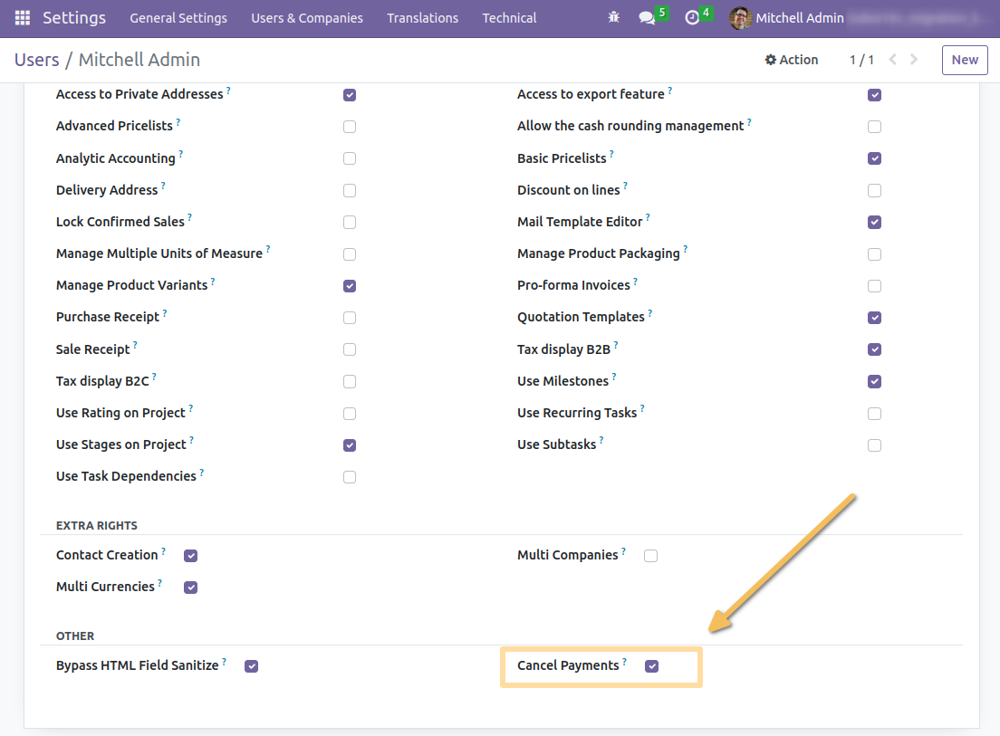

Payment Cancel Group
====================

.. contents:: Table of Contents

Context
-------
In vanilla Odoo, when the module account_cancel is installed, users with basic accounting access
are able to cancel a payment (if authorized on the journal).

Summary
-------
This module adds a user group allowed to cancel payments.

The `Cancel` button on payments is only displayed for members of this group.

When cancelling a payment, a message with the name of the user is logged in the chatter for traceability.

.. image:: static/description/payment_cancelled_message.png

Contributors
------------
* Numigi (tm) and all its contributors (https://bit.ly/numigiens)
