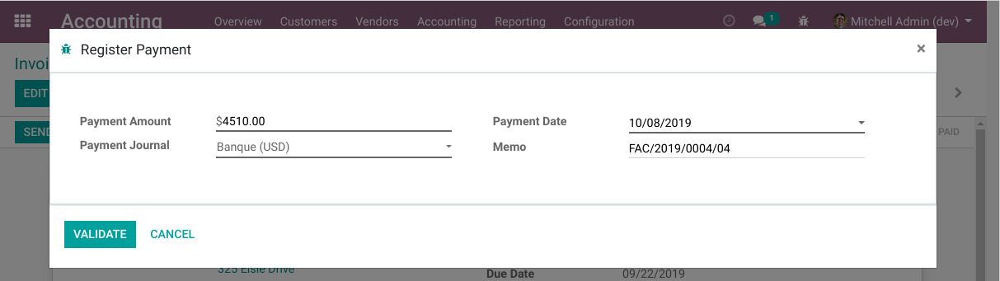
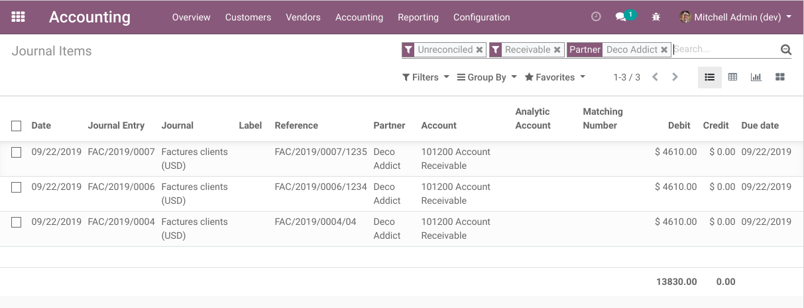
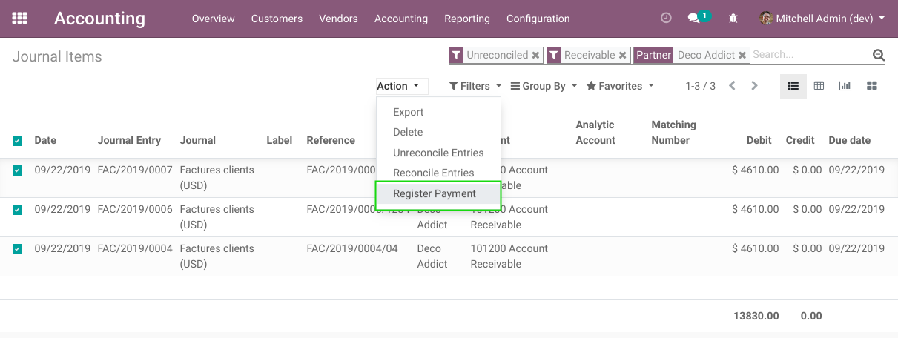
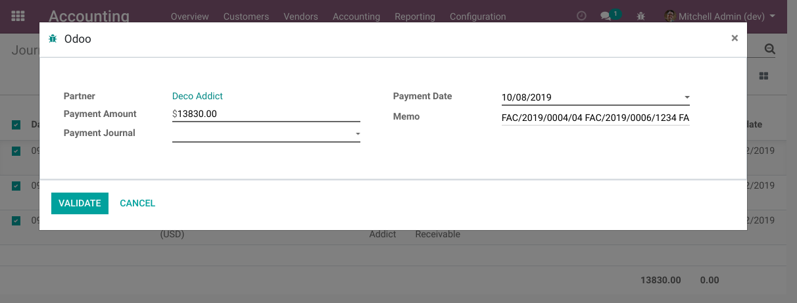
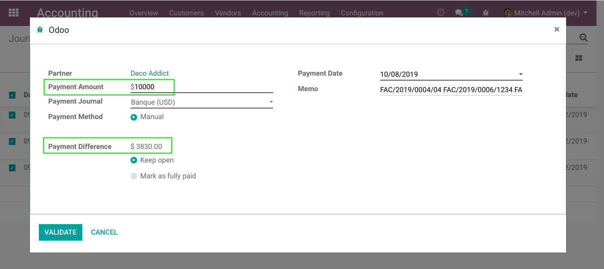
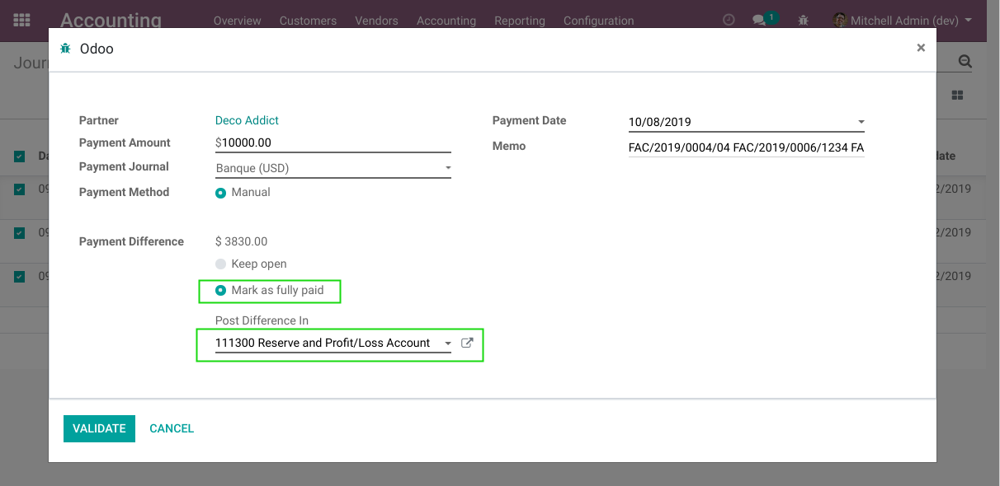
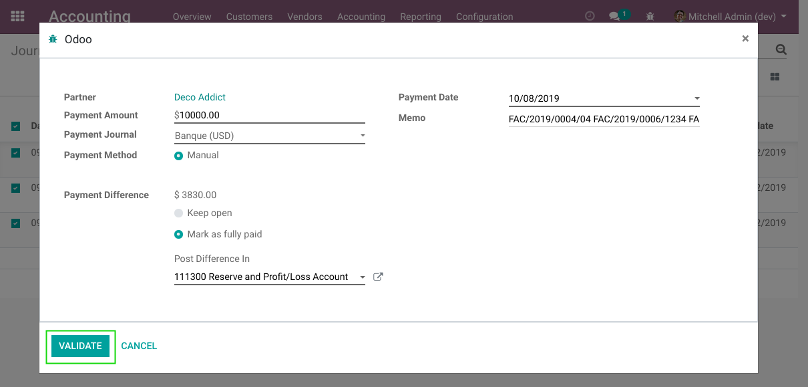
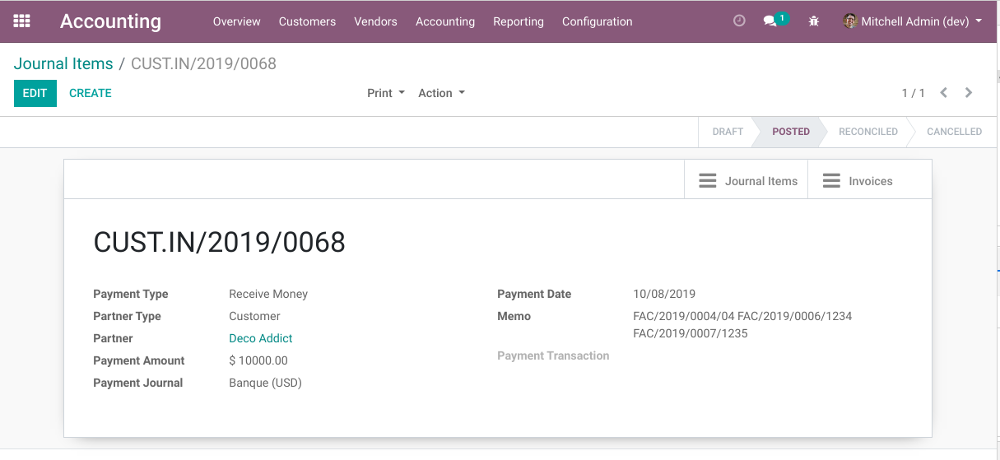
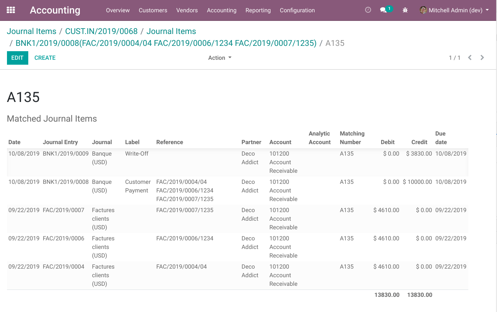

Account Payment From Move Line
==============================
This modules allows to generate a payment from an existing journal item (account.move.line).

.. contents:: Table of Contents

Context
-------
In vanilla Odoo, a payment can be registered directly from an invoice.

This allows to automatically fill the payment values based on the invoice.

However, a journal entry can be created manually to recognize a receivable item.

In such case, prefilling a payment from the receivable item is not possible (in vanilla Odoo).

Usage
-----
As member of the group ``Accounting / Billing``, I go to the list view of journal items.

I filter to display the receivable items for a given customer.

I select the items and click on ``Register a payment``.

A wizard is opened.

I notice that:

* The payment is prefilled with the sum of amounts from the selected receivables.
* The date of payment is ``Today`` (by default).
* The payment journal is not filled (a default value can be parametrized per company).

Then, I replace the prefilled amount with a partial payment amount and select a journal.

The system asks what to do with the balance; either ``Keep Open`` or ``Mark as Fully Paid``.

I select ``Mark as Fully Paid`` and select a ``Difference Account``.

I click on ``Validate``.

The form view of the new payment is open.

I notice that the selected receivable items are now reconciled.

Constraints
-----------
The journal items selected for registering payments must comply with the following constraints.
If one constraint fails, a detailled error message will be displayed.

Same Currency, Account and Partner
~~~~~~~~~~~~~~~~~~~~~~~~~~~~~~~~~~
Selected items must have the same currency, GL account and commercial partner.
This is required so that the payment can be reconciled with the selected journal items.

Unreconciled
~~~~~~~~~~~~
Selected items must not be fully reconciled.

Posted
~~~~~~
Selected items must be posted.

Known Issues
------------
For now, this module does not support payable journal items and outbound payments.
It only supports receivables and inbound payments.

The reason is that supporting payables and outbound payments adds extra complexity.
This complexity is not required by Numigi's clients.

A constraint is implemented to prevent users from selecting non-receivable journal items
for registering payments.

Contributors
------------
* Numigi (tm) and all its contributors (https://bit.ly/numigiens)
