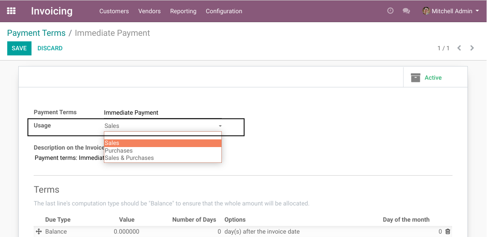
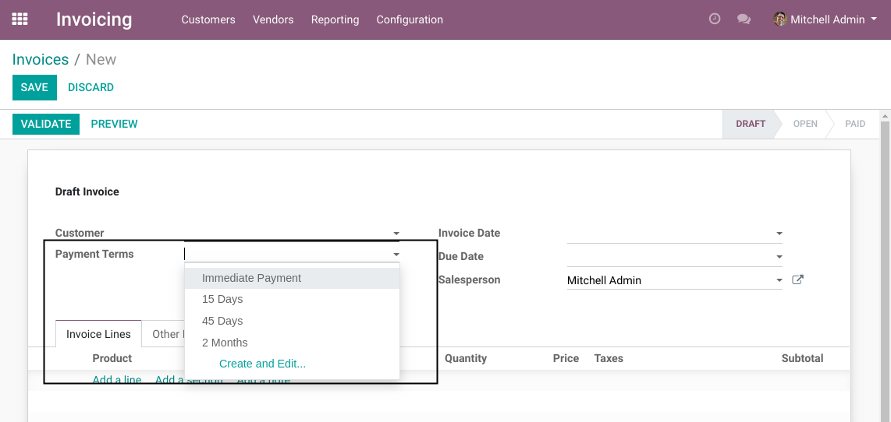
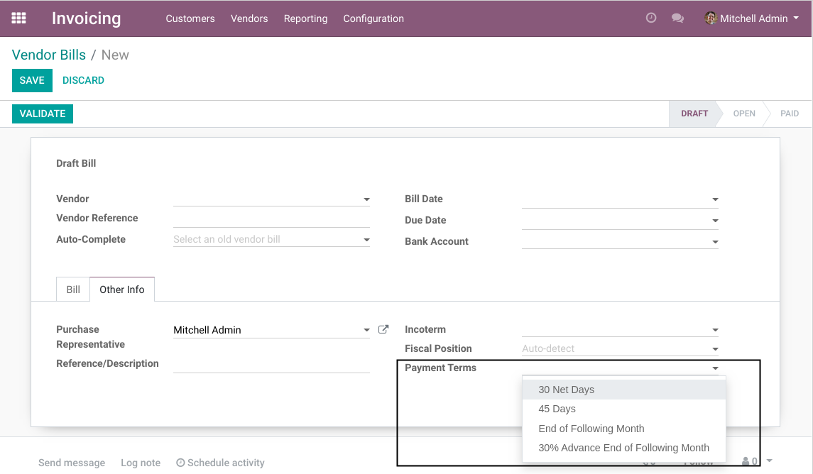

Account Payment Term Usage
==========================
This module allows to define whether a payment term can be used for sales or purchases.

In the form view of a customer invoice, payment terms allowed for sales are shown.

In the form view of a supplier invoice, payment terms allowed for purchases are shown.

Empty Payment Terms
-------------------
If the usage is empty on the payment term, then it will appear on both supplier and customer invoices.
The behavior is the same as the option ``Sales & Purchases``.

Contributors
------------
* Numigi (tm) and all its contributors (https://bit.ly/numigiens)
