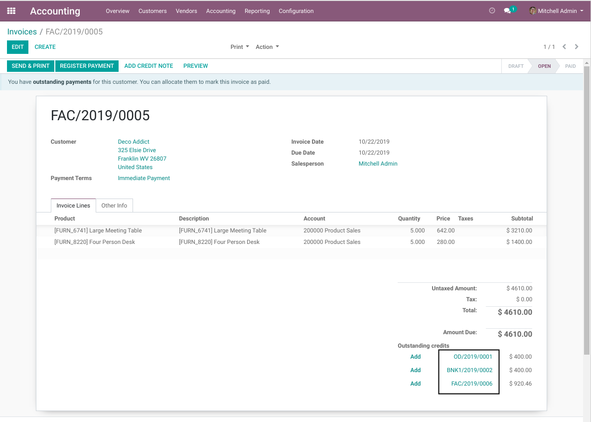
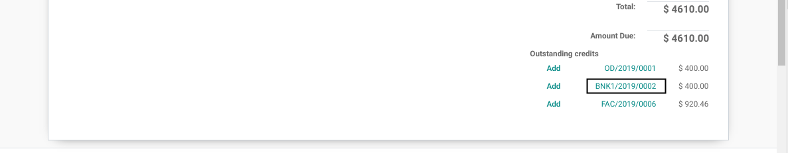
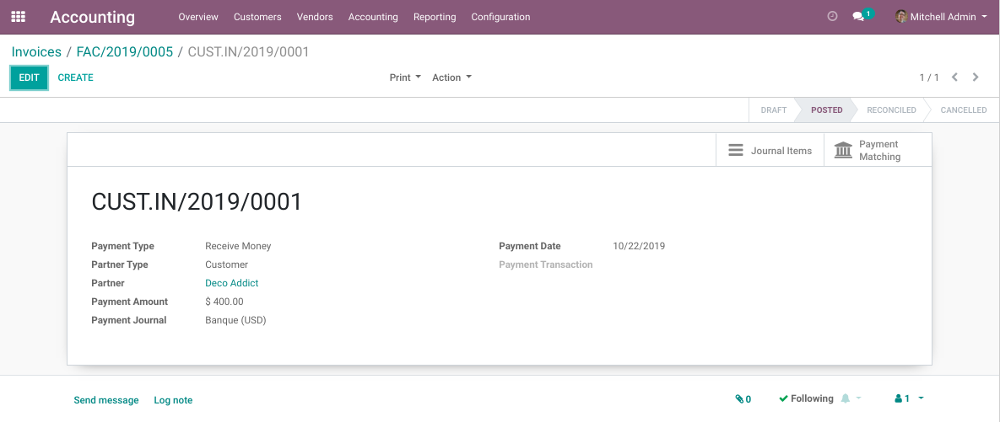
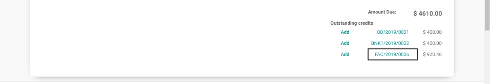
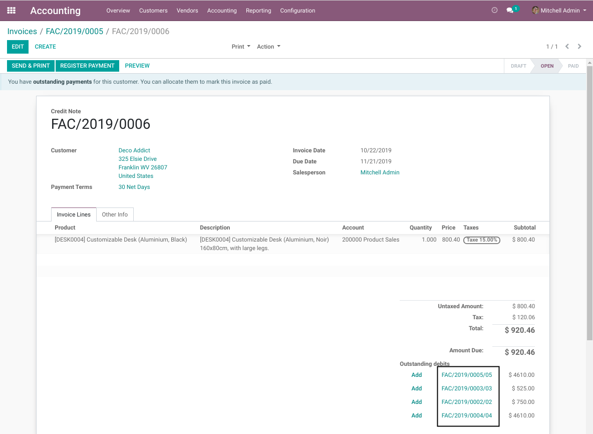
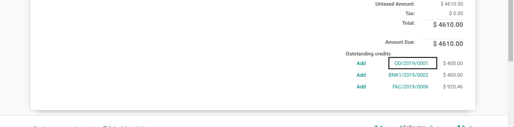

Account Payment Widget Link
===========================
This module improves the payment widget on invoices by making the items clickable.

.. contents:: Table of Contents

Usage
-----
As member of ``Accounting / Billing``, I go to the form view of an invoice.

I notice that the suggested payments and credit notes for this invoice are clickable.

Payments
~~~~~~~~
I click on a payment.

The form view of this payment is open.

Credit Notes
~~~~~~~~~~~~
Back to the invoice, I click on a credit note.

The form view of this credit note is open.

.. image:: static/description/credit_note_form.png

In the form view of the credit note, I notice that the suggested invoices are clickable.

Manual Journal Entries
~~~~~~~~~~~~~~~~~~~~~~
If a journal entry is not bound to a payment or a credit note, it will still appear as clickable in the payment widget.

When clicking on this item, the form view of the journal entry is open.

.. image:: static/description/manual_entry_form.png

Contributors
------------
* Numigi (tm) and all its contributors (https://bit.ly/numigiens)
