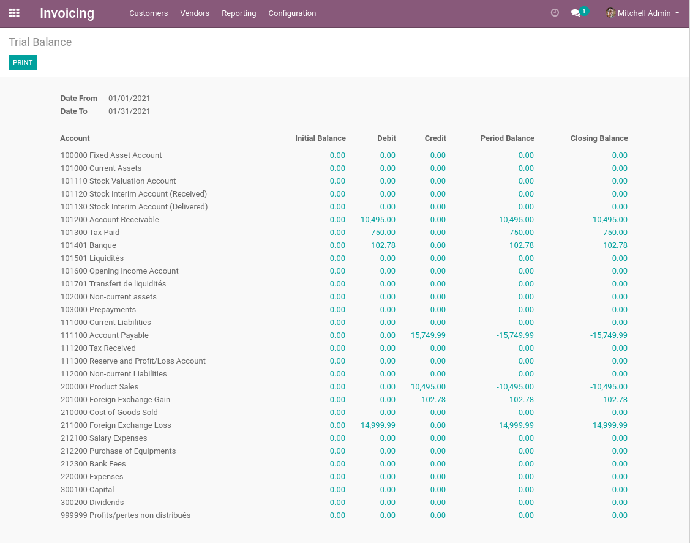
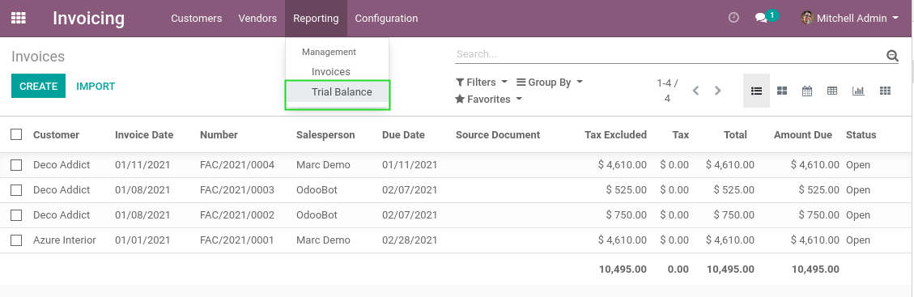
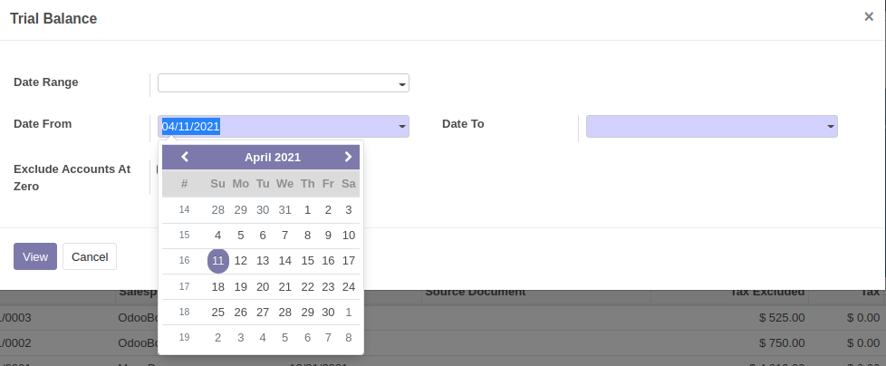
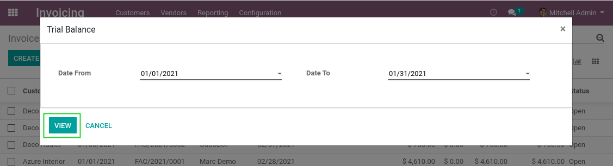
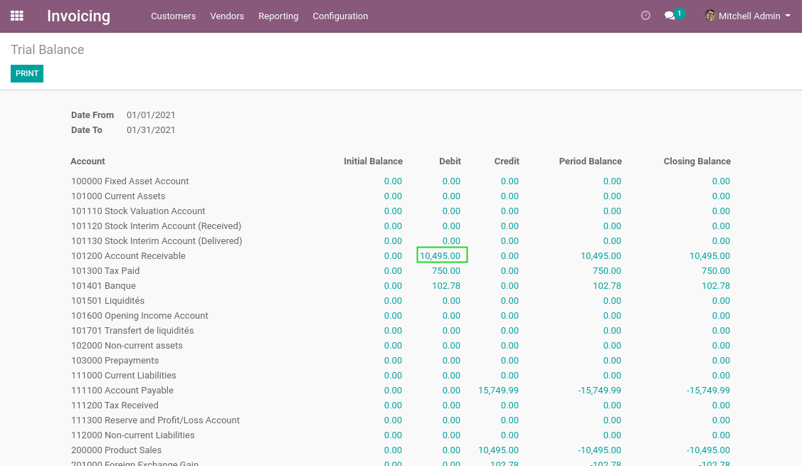
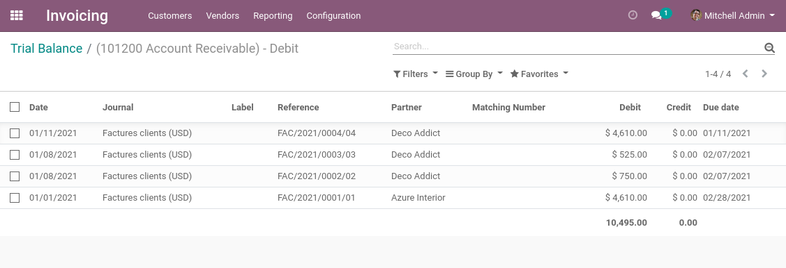
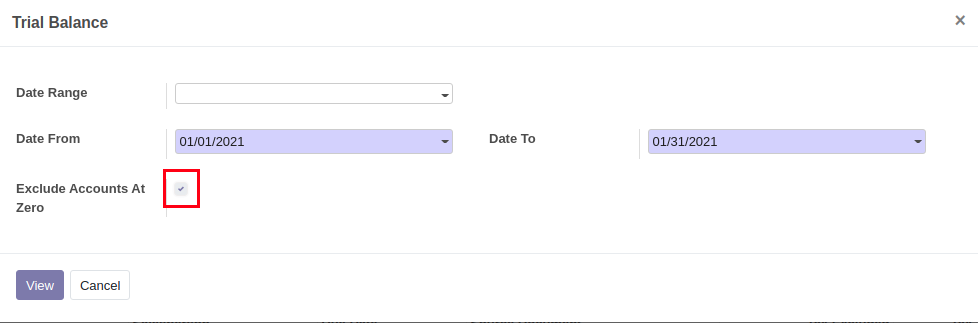
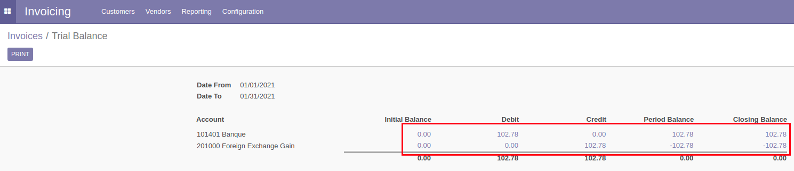

Account Report Trial Balance
============================

.. contents:: Table of Contents

Summary
-------
This module adds a dynamic trial balance report.

Usage
-----
I go to ``Invoicing / Reporting / Trial Balance``.

I select a date range for the report.

Then, I click on ``View``.
It selects only posted account move lines.

In the report, I can click on any amount to view the details.

When generating the report, you can also select to exclude accounts that have all their values at 0.

Contributors
------------
* Numigi (tm) and all its contributors (https://bit.ly/numigiens)
