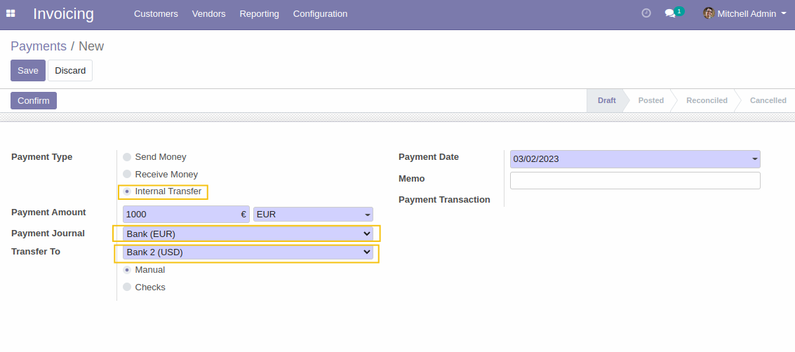

Account transfer with partner
=============================

This module allows setting the partner value of journal items to the active company partner
in the case of an internal transfer payment.

Overview
========

As a user of account application, I create a new internal transfer payment between two accounts.

I confirm the transfer and access the journal items.

I notice that the partner information was associated with the active company.

.. image:: .. image:: static/description/journal_items_partner.png

Contributors
------------
* Numigi (tm) and all its contributors (https://bit.ly/numigiens)
