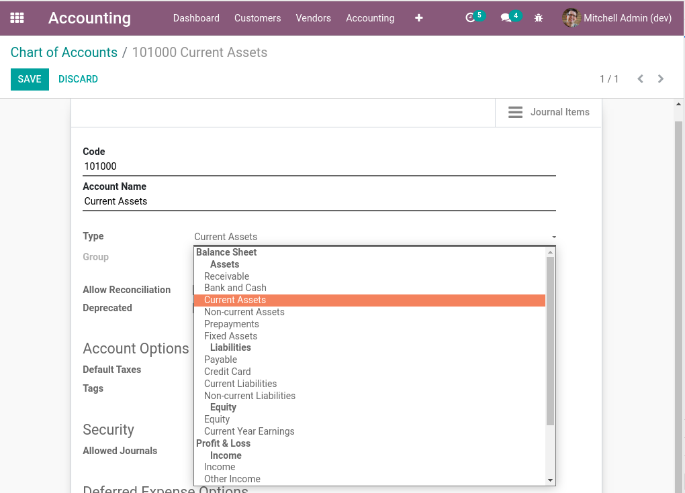
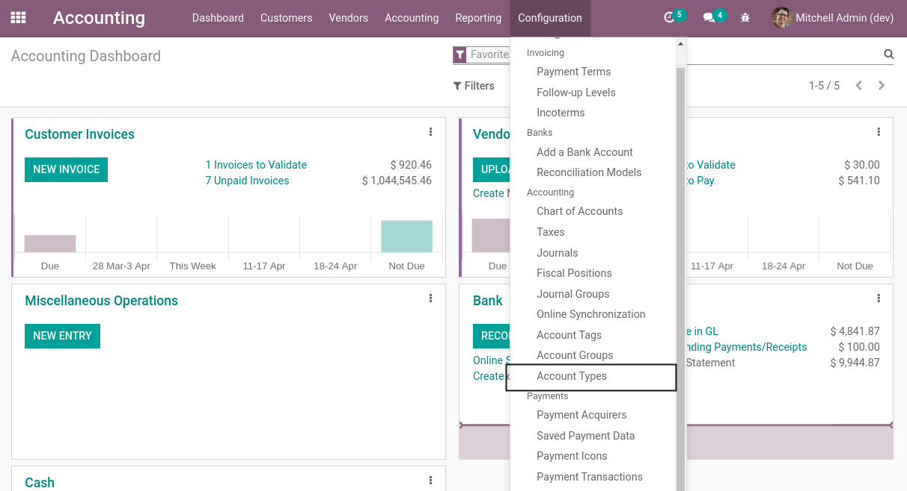
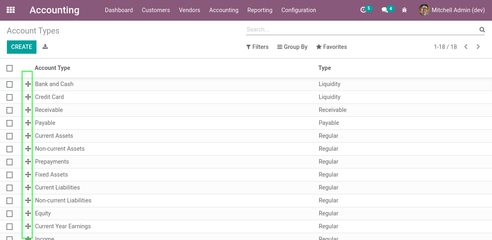
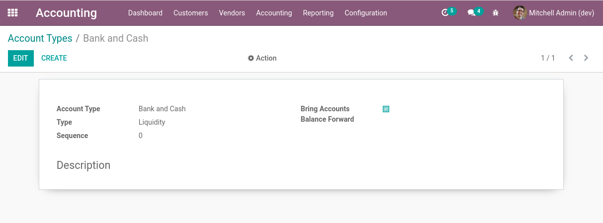
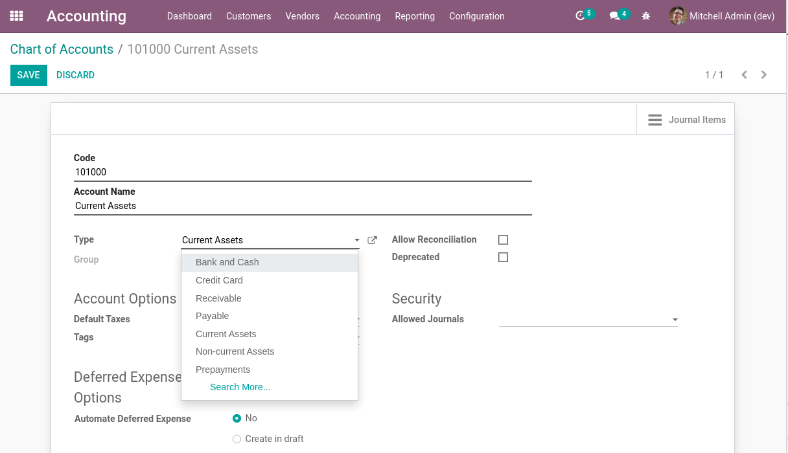

Account Type Sane
=================

.. contents:: Table of Contents

Context
-------
Odoo comes with the notion of a ``Type of Account``.

There are a few issues with this referential:

1. There is no menu to edit the list of account types.
2. The selector widget on accounts is misleading.
3. There is no sequence on account types.

Account Types
-------------
When this module is installed, a new menu entry is added to edit types of accounts.

I notice that the list view contains a sequence handle.

I can open the form view to edit an account type.

Accounts
--------
On accounts, I notice that the account type field is a standard manyone selector.

Contributors
------------
* Numigi (tm) and all its contributors (https://bit.ly/numigiens)
