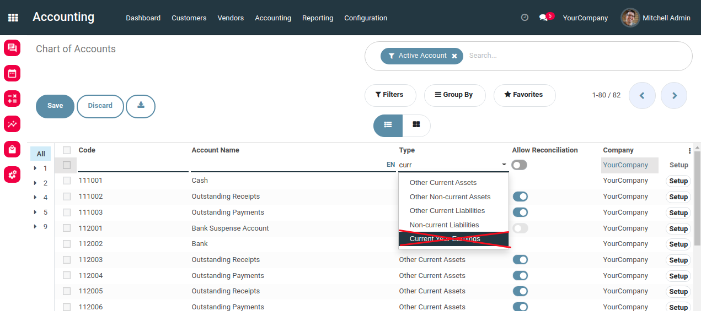

Account Unaffected Earnings Disabled
====================================
This module disables the ``Unaffected Earnings`` feature from Odoo.

Context
-------
In vanilla Odoo, there is a special feature for setuping the initial balance of a company.

When you import your chart of account, you may fill 2 fields opening_debit and opening_credit.
When doing so, a journal entry is created behind the scene for the opening balance.

The counterpart of the amounts defined in opening_debit and opening_credit are accruded
under a special account ``Undistributed Profits/Losses``.

This special automation is very suprising and misleading.
It is not clear if this account is related to ``Retained Earnings``.

When importing an initial balance, the imported debits and credits should balance.
Letting the system decide arbitrarily where to put the difference can lead to errors.

Overview
--------

Current Year Earnings
~~~~~~~~~~~~~~~~~~~~~
This module hides the account type ``Current Year Earnings`` in the form/list view of an account.

This account type should not be archived, because different modules assume that it exists.

Initial Balance
~~~~~~~~~~~~~~~
The module also blocks writing in the fields opening_debit and opening_credit of account.account.
Therefore, the automatic initial balance is never created.

You may import the initial balance as a normal journal entry.

Contributors
------------
* Numigi (tm) and all its contributors (https://bit.ly/numigiens)
