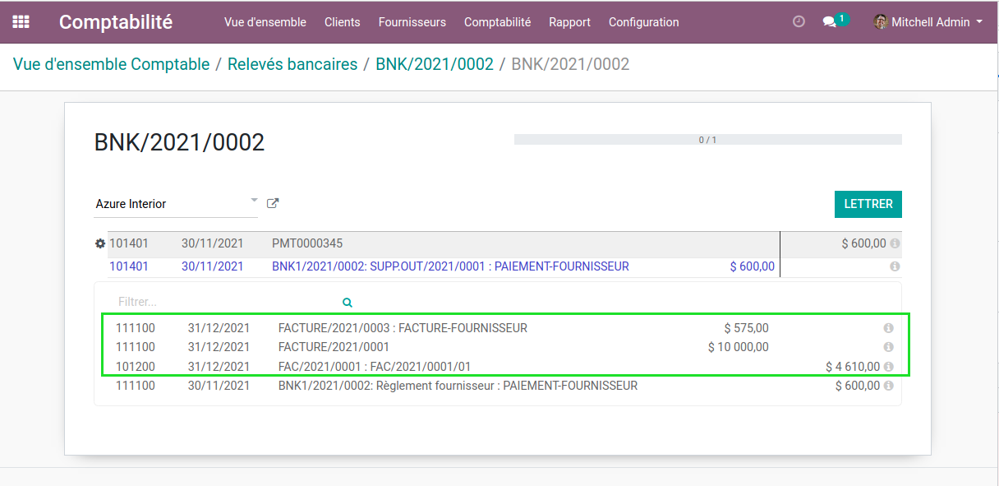
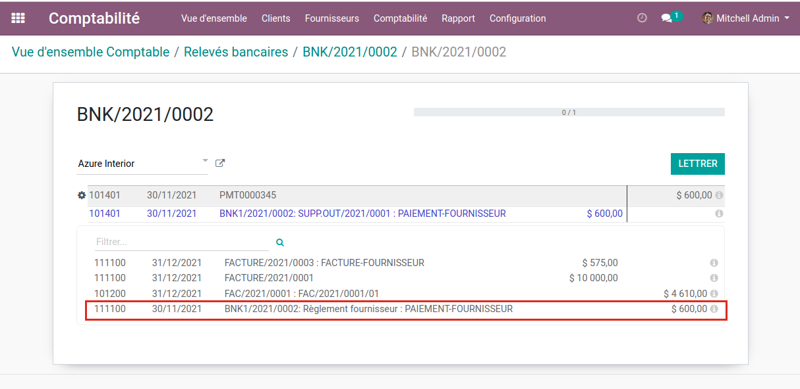
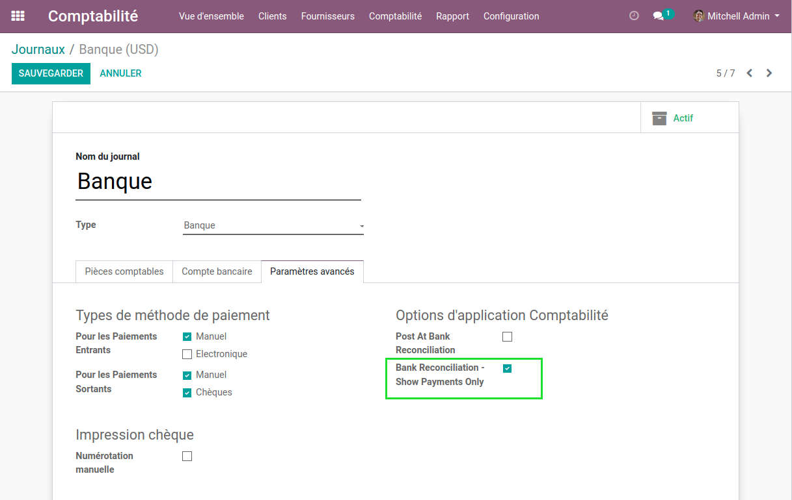
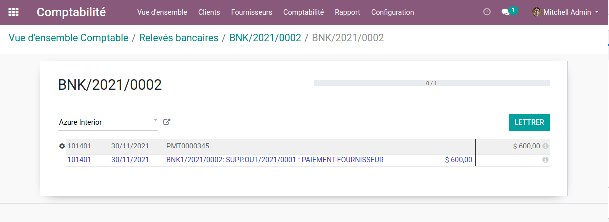

Bank Reconciliation Filter
==========================

.. contents:: Table of Contents

Context
-------

Payable / Receivable Items
~~~~~~~~~~~~~~~~~~~~~~~~~~
In vanilla Odoo, when reconciling a bank statement, it is possible to match a bank statement line
with a payable or receivable journal item.

Typically, this is useful for credit cards, where the payment is not manually recorded in Odoo.

For real bank accounts, this option is not relevant.
On the contrary, it obfuscates the user interface with extra items and makes the reconciliation more difficult.

Payment Counterparts
~~~~~~~~~~~~~~~~~~~~
Also, in vanilla Odoo, the payable / receivable counterpart of a payment is proposed to reconcile.

These payable items should be reconciled with an invoice, not with a bank statement line.

After installing the module, these items are hidden, whatever the configuration.

Overview
--------
After installing this module, I go to the form view of a bank journal.

I notice a new checkbox ``Bank Reconciliation - Show Payments Only``.

This box is unchecked by default.

When checked, only the journal items of type liquidity (payments)
are proposed when reconciling a bank statement line.

Contributors
------------
* Numigi (tm) and all its contributors (https://bit.ly/numigiens)

More information
----------------
* Meet us at https://bit.ly/numigi-com
