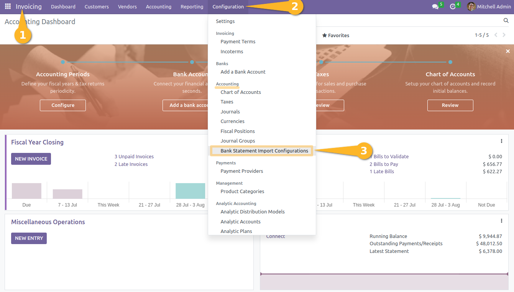

Bank Statement Import CSV
=========================

.. contents:: Table of Contents

Summary
-------
This module allows to import bank statement in CSV format,
without the headache that usually comes with it.

Context
-------

File Parameters
~~~~~~~~~~~~~~~
A common format of file available to export a bank statement in most banks is ``csv``.

A ``csv`` file relatively easy to parse as long as you have the correct parameters including:

* The encoding
* The field delimiter
* The quote char

Then, you need to convert each field into the correct data type.
Converting text into dates, numbers and currencies requires carefulness.

A known issue with bank statement files is that users manipulate the file
(with a non-developper software, typically Excel) before uploading it into the system.

Typically, they does so in order to remove extra content at the beginning of the file.

Doing so, the user (without aknowledging it) changes the parameters of the file,
sometimes making it non-readable by the system.

Field Mapping
~~~~~~~~~~~~~
When loading a csv file, you need to know which column appears where in the file.

One way of identifying the fields is to match the name of the columns.

Another way is to identify columns by their position.

Either way, no solution prevents the format to change over time,
thus making the mapping obsolete.

However, the position of columns is less likely to change over time
than the header labels.

Configuration
-------------
As member of ``Accounting / Manager``, I go to
``Accounting / Configuration / Bank Statement Import Configurations``.

I click on ``Create``.

.. image:: static/description/import_config_form.png

I define the different parameters according to the csv format provided by my bank.

First Row
~~~~~~~~~
The ``First Row`` parameter defines the line at which the first transaction appears.

Here is an example of file where the first row is ``3``.

Contributors
------------
* Numigi (tm) and all its contributors (https://bit.ly/numigiens)

More information
----------------
* Meet us at https://bit.ly/numigi-com
