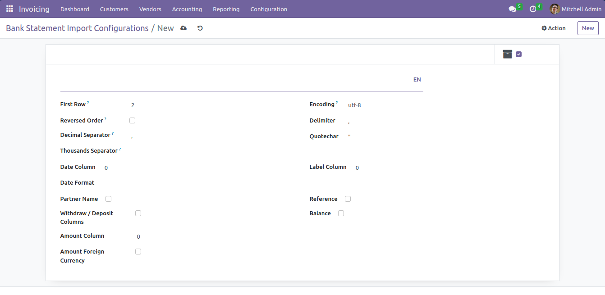
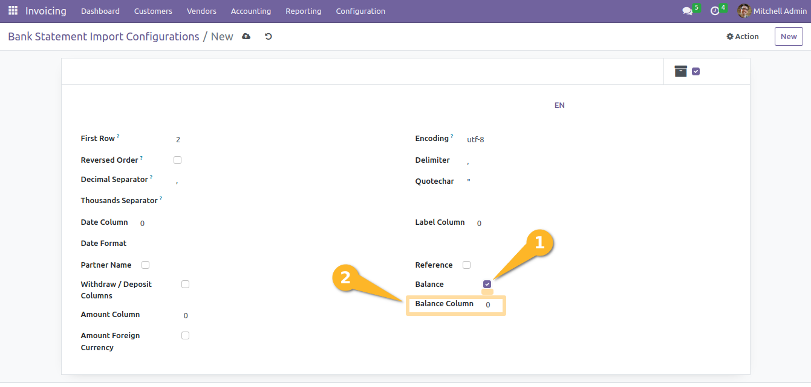
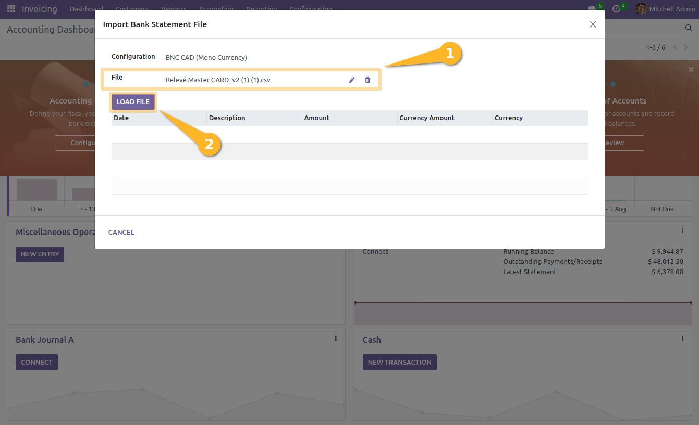
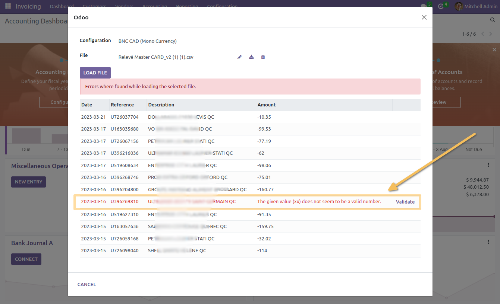
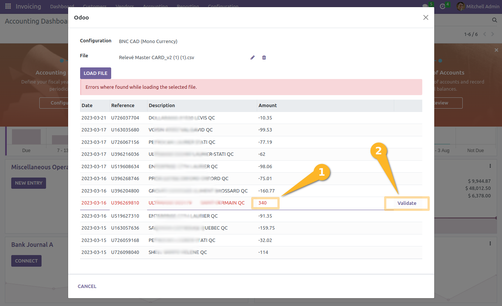

Bank Statement Import CSV
=========================

.. contents:: Table of Contents

Summary
-------
This module allows to import bank statement in CSV format,
without the headache that usually comes with it.

Context
-------

File Parameters
~~~~~~~~~~~~~~~
A common format of file available to export a bank statement in most banks is ``csv``.

A ``csv`` file relatively easy to parse as long as you have the correct parameters including:

* The encoding
* The field delimiter
* The quote char

Then, you need to convert each field into the correct data type.
Converting text into dates, numbers and currencies requires carefulness.

A known issue with bank statement files is that users manipulate the file
(with a non-developper software, typically Excel) before uploading it into the system.

Typically, they does so in order to remove extra content at the beginning of the file.

Doing so, the user (without aknowledging it) changes the parameters of the file,
sometimes making it non-readable by the system.

Field Mapping
~~~~~~~~~~~~~
When loading a csv file, you need to know which column appears where in the file.

One way of identifying the fields is to match the name of the columns.

Another way is to identify columns by their position.

Either way, no solution prevents the format to change over time,
thus making the mapping obsolete.

However, the position of columns is less likely to change over time
than the header labels.

Configuration
-------------
As member of ``Accounting / Manager``, I go to
``Accounting / Configuration / Bank Statement Import Configurations``.

.. image:: static/description/import_config_menu.png

I click on ``Create``.

I define the different parameters according to the csv format provided by my bank.

First Row
~~~~~~~~~
The ``First Row`` parameter defines the index of the line at which the first transaction appears.

Here is an example of file where the first row is ``2``.

.. image:: static/description/example_csv_first_row.png

Note that in most ``csv`` editors, the first line is number ``1``.
However, the index of the first line in the file is technically ``0``.

Reversed Order
~~~~~~~~~~~~~~
Check this box if your transactions appear in backward order in your csv file.

This is mostly relevant if the csv file contains a balance column.
In such case, the first and last rows in the file are used to determine the
initial and ending balance.

Encoding
~~~~~~~~
The field ``Encoding`` must contain the technical value of the format in which the file is encoded.

Typical values include:

* utf-8
* latin-1
* cp1252

Delimiter
~~~~~~~~~
The field ``Delimiter`` must contain the character used to seperate fields in the csv file.

Quotechar
~~~~~~~~~
The field ``Quotechar`` must contain the character used as text delimiter.

Columns
~~~~~~~

Date
****
The date is a mandatory column in the csv file.

You must supply the index of the column and the format used to parse the date.

The format must be specified in `Python Syntax <https://docs.python.org/3/library/datetime.html#strftime-and-strptime-format-codes>`_.

The most common formats are:

* %d-%m-%Y
* %d/%m/%Y
* %m-%d-%Y
* %m/%d/%Y
* %Y-%m-%d
* %Y/%m/%d

Label
*****
The ``Label Index`` field is mandatory.

It is mapped to the field ``Label`` (name) of the bank statement line.

Reference
*********
The ``Reference`` field is optional.

It is mapped to the field ``Reference`` (ref) of the bank statement line.

Amounts
*******
The module supports either an amount displayed as a single column in the file,
or withdraws and deposits separated in two columns.

If ``Withdraw / Deposit`` is checked, you need to supply indexes for both columns.

If ``Withdraw / Deposit`` is unchecked, you need to supply the index of the amount column.

Balance
*******
Optionnaly, the module allows to parse a balance column, containing the balance
of the bank account after the transaction.

This column does not add any info to the bank statement line itself.

However, it allows to automatically fill the initial and ending balances of the bank statement.

Amount Foreign Currency
***********************
In case your bank statement contains transactions in multiple currencies,
you may parse two extra columns.

The column ``Currency`` expects the code of the currency in which the transaction occured.

The column ``Currency Amount`` expects the original amount of the transaction in the foreign currency.

The module only maps these fields for transactions in a currency different from the company currency.

Journal
~~~~~~~
I go to the form view of my bank journal.

In the tab ``Bank Account``, I select my statement import configuration.

.. image:: static/description/journal_form.png

Usage
-----
I go to the accounting dashboard and click on ``Import Statements``.

The import wizard is opened.

The configuration defined on my journal is prefilled.

I upload my file and click on ``Load File``.

..

    The extra step of clicking on a button after uploading the file is
    due to limitations in the Odoo framework.

After loading the file, the system shows a row in red, meaning that there
were errors parsing the row.

I can manually fix the data in the row in error.
When a row is corrected, I click on ``Validate``.

When all rows are corrected, the confirmation button appears in the bottom of the file.

After clicking on the button, the new bank statement is displayed.

I notice that the transaction lines where properly created.

I also notice that the initial and ending balances are properly set.

Contributors
------------
* Numigi (tm) and all its contributors (https://bit.ly/numigiens)

More information
----------------
* Meet us at https://bit.ly/numigi-com
