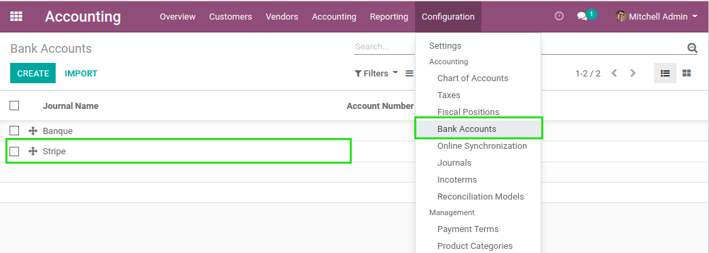
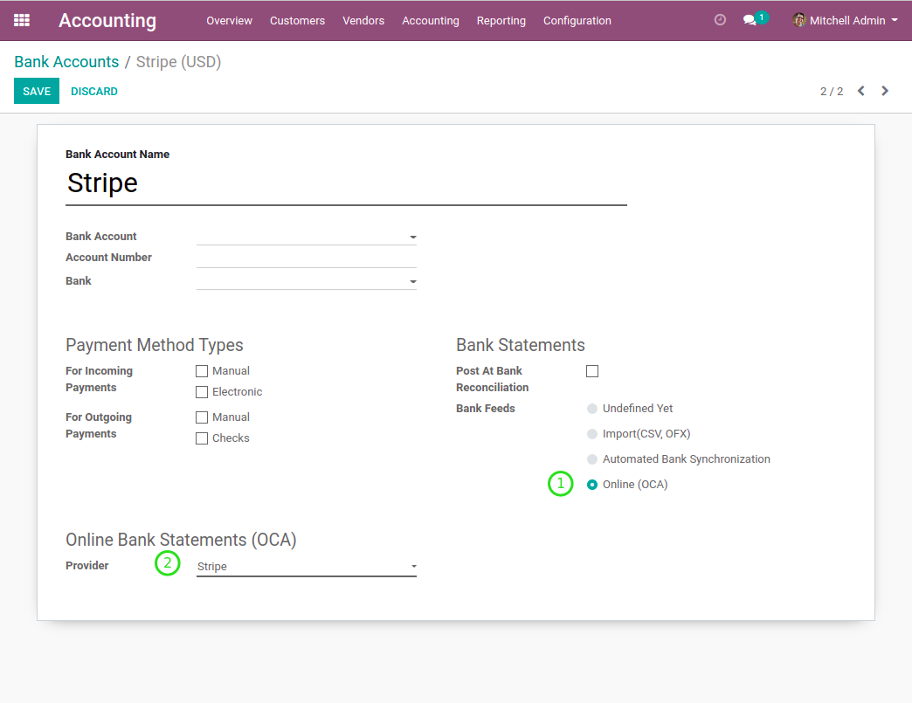
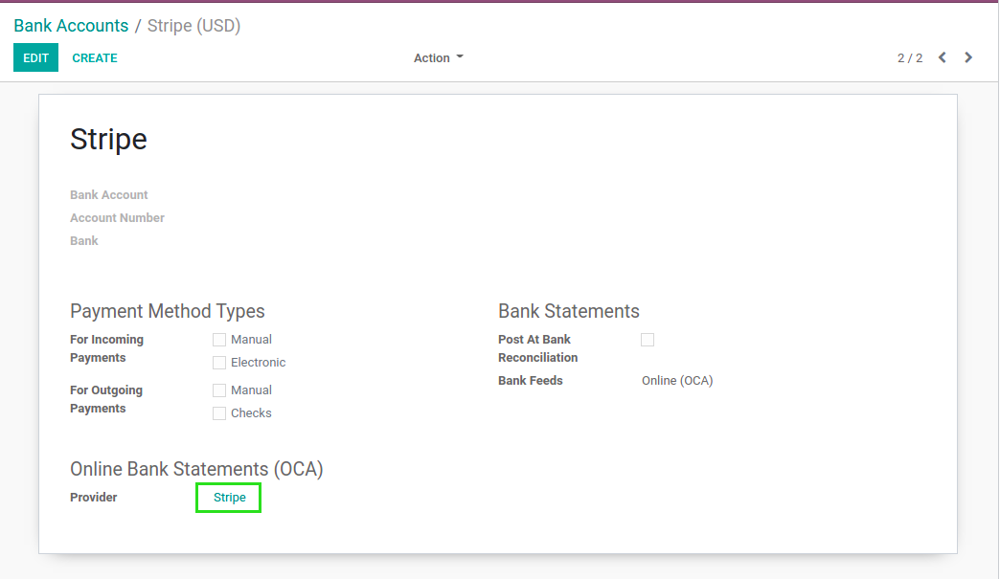
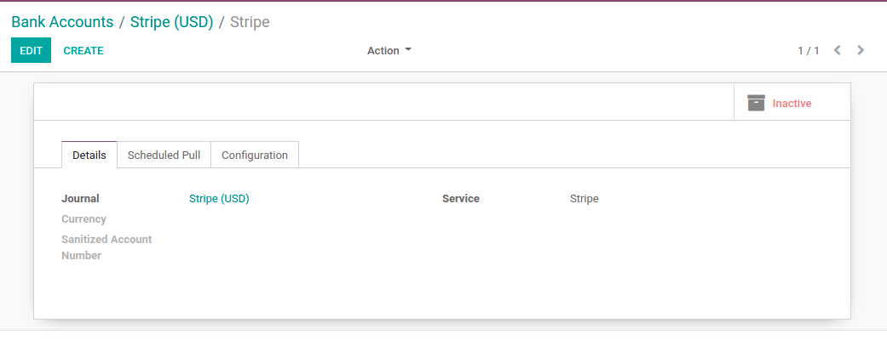
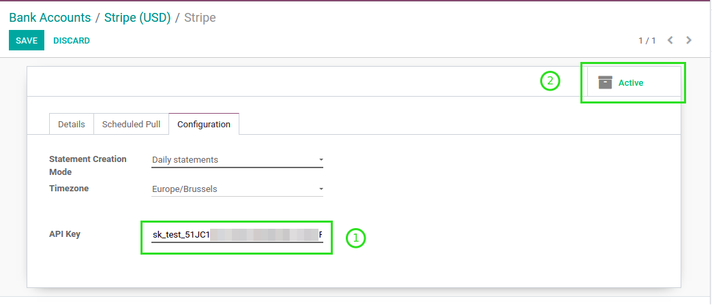
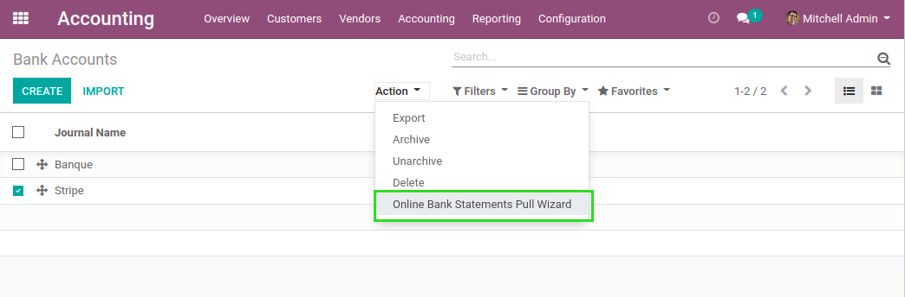
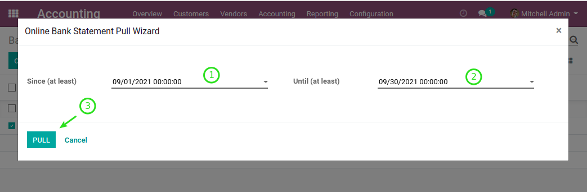
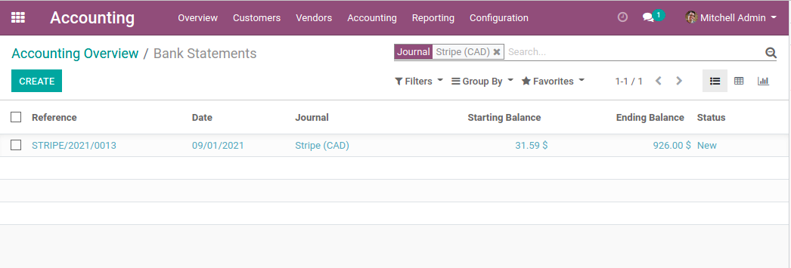
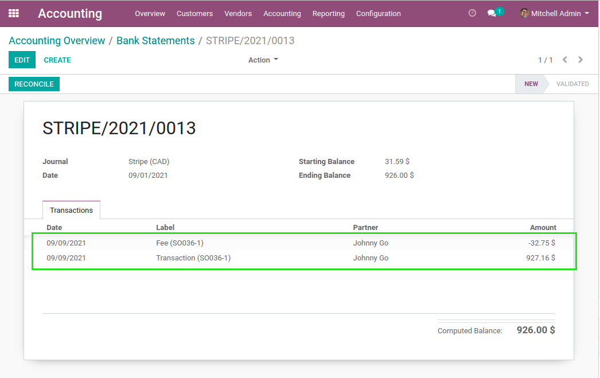
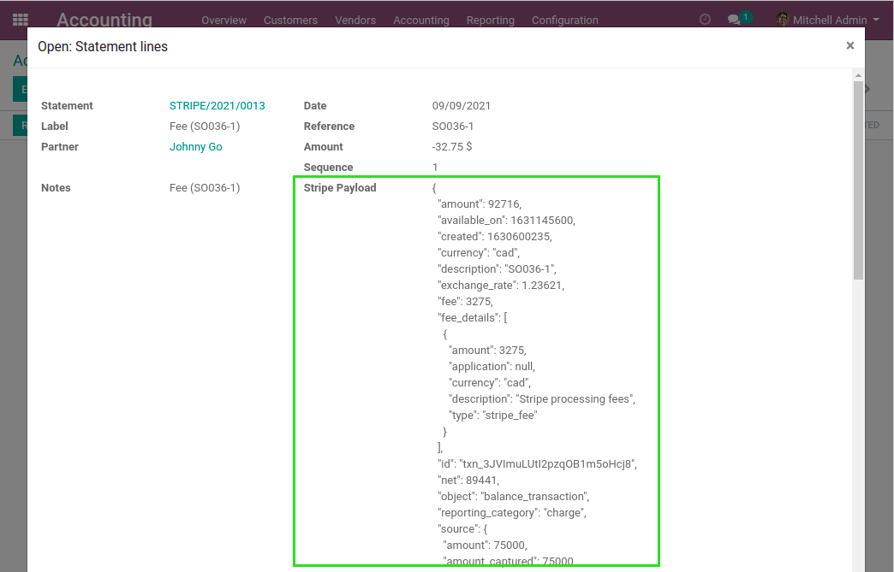

Bank Statement Online Stripe
============================

.. contents:: Table of Contents

Context
-------
Stripe is an online payment solution for ecommerce.

Odoo natively allows to process a checkout order using Stripe as payment method.

However, Odoo does not allow to import bank statements from Stripe.

Overview
--------
This module extends the module `account_bank_statement_import_online <https://github.com/OCA/bank-statement-import/tree/12.0/account_bank_statement_import_online>`_.

It adds ``Stripe`` as a source from which to import bank statements.

Configuration
-------------
As ``Accounting / Manager``, I go the list of bank accounts and select ``Stripe``.

1. I select ``Online (OCA)`` in ``Bank Feeds``

2. Then, I select ``Stripe`` as provider

After saving, I click on ``Stripe``.

The form view of the ``Stripe`` provider is open.

By default, the provider is inactive.

Before activating it, I go to the ``Configuration`` tab and paste my api key.

Usage
-----
Back to the list of bank accounts, I select ``Stripe``
and click on the action ``Online Bank Statements Pull Wizard``.

I select a range of dates and click on ``Pull``.

In the list view of bank statements, I notice that a new statement was imported from ``Stripe``.

In the form view of the bank statement, I notice that two lines were imported.

* One line for the payment of the order SO0036
* One line for the Stripe fee matching this transaction

I also notice that the partner was properly selected.
This is done automatically using the email address.

If I click on a statement line, I can see the payload from Stripe.

Known Issues
------------

Payment Date
~~~~~~~~~~~~
Note that the module uses the creation date of a balance transaction instead of
its date of availability in order to determine whether a transaction should be imported or not.

This means that the balance shown in the bank statement in Odoo does not reflect
the amount available for a payout in Stripe.

Contributors
------------
* Numigi (tm) and all its contributors (https://bit.ly/numigiens)

More information
----------------
* Meet us at https://bit.ly/numigi-com
