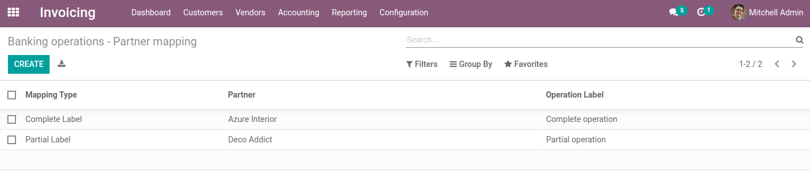
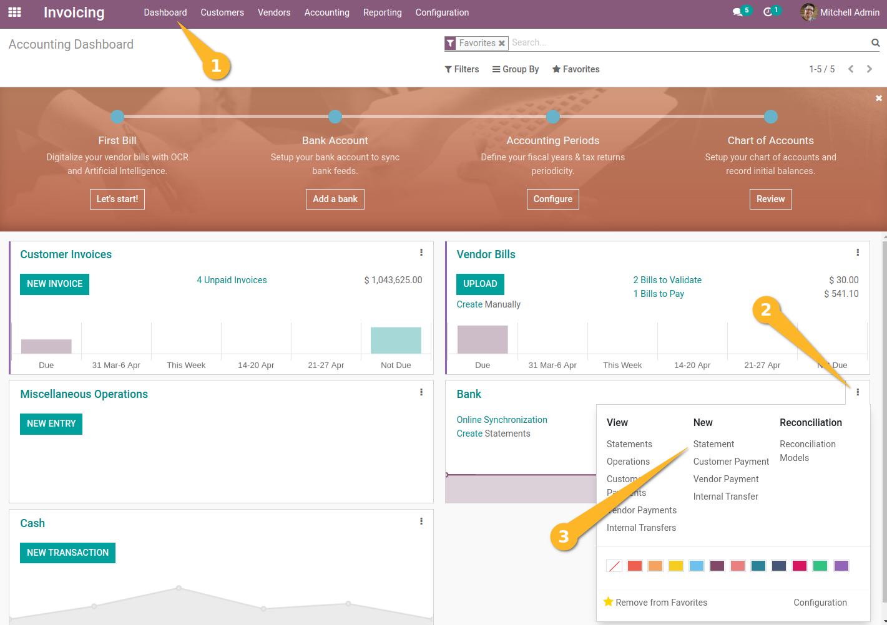
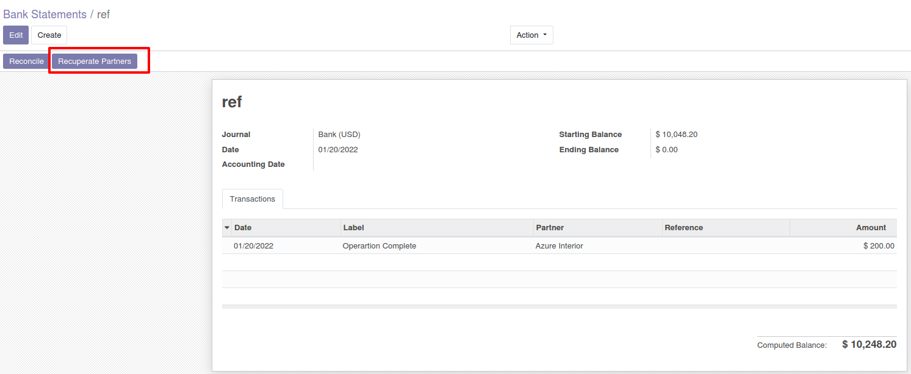

Bank Statement Partner Mapping
===============================

This module allows to recuperate partners for bank statements operations.

Usage
-----

The configuration of `Banking operations - Partner mapping` menu item is available through the ``Invoicing / Configuration / Accounting`` menu:

You can access the bank statement following the menus :

In bank statement form view, we can recuperate partners based on configuration of `Banking operations - Partner mapping`.

Contributors
------------
* Numigi (tm) and all its contributors (https://bit.ly/numigiens)
