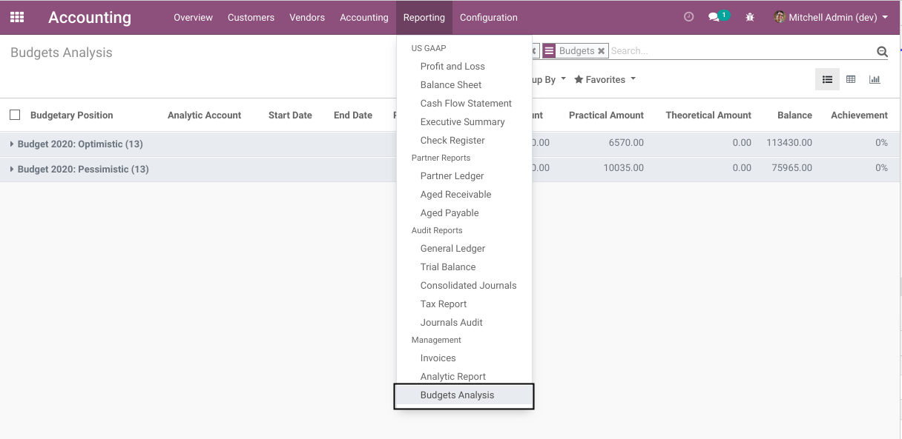
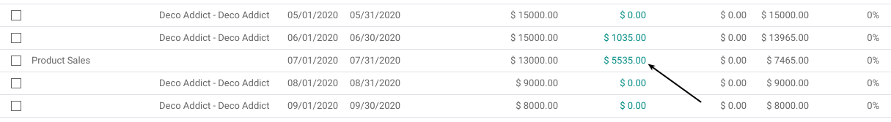
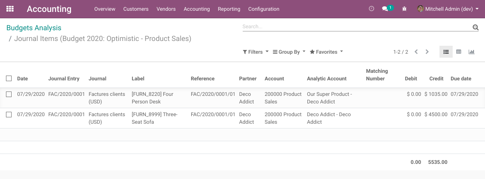

Budget Analysis Account Move Lines
==================================
This module allows to open the list of journal entries from a budget line.

Usage
-----
As member of the group ``Accounting & Finance / Accountant``, I go to ``Accounting / Reporting / Budget Analysis``.

I notice that the amounts in the column ``Practical Amount`` are clickable.

.. image:: static/description/budget_line_list.png

If I click on one of these amounts, the list of journal items related to this budget line is displayed.

Contributors
------------
* Numigi (tm) and all its contributors (https://bit.ly/numigiens)
