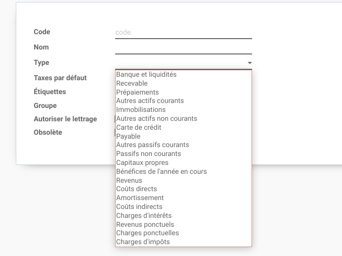

Canada Account Types
====================
This module renames terms for account types and add missing types for the Canada accounting.

Context
-------
In Canada, some french accounting terms are different from France.
This module attempts to alleviate some ambiguity caused by these differences.

The module also attemps to make the types of account more explicit, even in english.

The final goal of this module is to have the required categories for
the balance sheet and the income statement.

Summary
-------

.. image:: static/description/account_types_english.png

Balance Sheet
~~~~~~~~~~~~~

Assets
******

* Bank and Cash
* Receivable
* Prepayments
* Other Current Assets
* Fixed Assets
* Other Non-current Assets

Liabilities and Equity
**********************

* Credit Card
* Payable
* Other Current Liabilities
* Non-current Liabilities
* Equity

Income Statement
~~~~~~~~~~~~~~~~

* Revenue
* Cost of Revenue
* Depreciation
* Indirect Costs
* Interest Expenses
* One-time Revenue
* One-time Expenses
* Tax Expenses

Interest Expenses
~~~~~~~~~~~~~~~~~
In french, this category is named ``Charges d'intérêts``.

It goes between the ``Earnings Before Interest & Taxes (EBIT)`` and the ``Earnings Before Taxes (EBT)`` in the income statement.

One-time Expenses
~~~~~~~~~~~~~~~~~
This category contains extraordinary expenses that should be presented distinctly from the operating income.

It goes between the ``Earnings Before Interest & Taxes (EBIT)`` and the ``Earnings Before Taxes (EBT)`` in the income statement.

Tax Expenses
~~~~~~~~~~~~
In french, this category is named ``Charges d'impôts``.

It goes between the ``Earnings Before Taxes (EBT)`` and the ``Net Profit`` in the income statement.

Renamed Categories
------------------
Below is the details regarding which term has been renamed and why.

Other Current Assets
~~~~~~~~~~~~~~~~~~~~
The category ``Current Assets`` is renamed ``Other Current Assets``.

The reason is that there are already categories for ``Receivable``, ``Prepayments`` and ``Bank and Cash``.
These are current assets as well.

In french, the category is renamed ``Autres actifs courants``.

Fixed Assets
~~~~~~~~~~~~
The category ``Fixed Assets`` is translated to ``Actifs immobilisés`` in french.

This is a term usually used in France, but not in Canada.
The module renames the category to ``Immobilisations``.

Non-current Assets
~~~~~~~~~~~~~~~~~~
The category ``Non-current Assets`` is renamed to ``Other Non-current Assets``.

This is because a fixed asset is also a kind of non-current asset.

In french, the term is renamed ``Autres actifs non-courants``.

Other Current Liabilities
~~~~~~~~~~~~~~~~~~~~~~~~~
The category ``Current Liabilities`` is renamed ``Other Current Liabilities``.

The reason is the same as for ``Current Assets``.

In french, the category is renamed ``Autres passifs courants``.

Revenue
~~~~~~~
The category ``Income`` is renamed to ``Revenue``.
This is usually the term used in Canada.

One-time Revenue
~~~~~~~~~~~~~~~~
The category ``Other Income`` is renamed ``One-time Revenue``.

It is unusual to have 2 categories for revenues in the computation of the operating income.

However, ``One-time Revenues`` can be displayed between the ``Earnings Before Interest & Taxes (EBIT)`` and the ``Earnings Before Taxes (EBT)`` in the income statement.

Other Indirect Costs
~~~~~~~~~~~~~~~~~~~~
The category ``Expenses`` is renamed ``Other Indirect Costs``.

There is already a category for direct costs named ``Cost of Revenue``.

The category ``Depreciation`` is also a kind of indirect costs.

Therefore, we renamed the category ``Other Indirect Costs`` so that it contains indirect costs
except for ``Depreciation`` (amortization).

Contributors
------------
* Numigi (tm) and all its contributors (https://bit.ly/numigiens)
