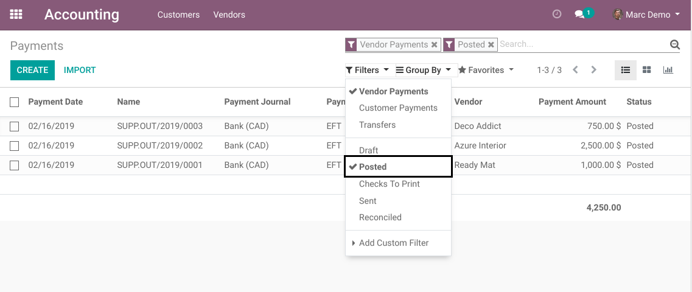

========================
Canada EFT Bank Transfer
========================
This module enables to generate credit transfer files for transactions between bank accounts in Canada.

Configuration
-------------
As member of `Accounting / Manager`, I go to the list view of accounting journals.

.. image:: static/description/journal_list.png

I open the form view of my bank journal.

In the 'Advanced Settings' tab, I see a checkbox `EFT`.

.. image:: static/description/journal_form_eft_checkbox.png

Once checked, a new section `EFT` appears bellow.

.. image:: static/description/journal_form_eft_fields.png

This section contains 3 fields.

User Short Name
~~~~~~~~~~~~~~~
This is a short version of your company name.
It must be composed of maximum 15 alphanumeric caracters.

User Number
~~~~~~~~~~~
This number is attributed by your bank to identify your company.
It is composed of 10 alphanumeric caracters.

Destination
~~~~~~~~~~~
Your bank will provide this number to you.
This is a technical value of 5 digits used in the EFT file.
It indicates the data processing center that will handle your tranfers.
The value depends on the bank and the location of your company.

.. image:: static/description/journal_form_eft_fields_filled.png

Next, I go to the `Bank Account` tab.

.. image:: static/description/journal_form_bank_account_tab.png

In the field `Bank Account`, I click on "Create and Edit".

.. image:: static/description/journal_form_bank_account_field.png

I fill my bank account number. It is composed from 7 to 12 digits.

.. image:: static/description/bank_account_number.png

In the field `Bank`, I click on "Create and Edit".

.. image:: static/description/bank_account_bank_field.png

I fill the name of the bank and its institution number, then I click on `Save`.

.. image:: static/description/bank_fields.png

Back in the form view of my bank account, I fill the transit (branch) then I click on `Save`.

.. image:: static/description/bank_account_transit.png

The configuration of my journal is now complete, I click on `Save`.

.. image:: static/description/journal_form_save.png

Preparing the Payments
----------------------
As member of `Accounting / Billing`, I go to `Accounting / Vendors / Payments`.
Then I click on `Create`.

.. image:: static/description/vendor_payment_list.png

I fill the partner and the payment amount. I check `EFT` as payment method.

.. image:: static/description/payment_form.png

I click on `Save`, then I click on `Confirm`.

.. image:: static/description/payment_form_confirm.png

The payment is now `Posted`. At this stage, it is ready to be selected for an EFT transfer.

.. image:: static/description/payment_form_posted.png

Preparing the EFT
-----------------
Once I have multiple EFT payments posted, I go back to the list of vendor payments.

I select only the posted payments.

In the search bar, I filter to have only payments with the `EFT` payment method.

Contributors
------------
* Numigi (tm) and all its contributors (https://bit.ly/numigiens)
