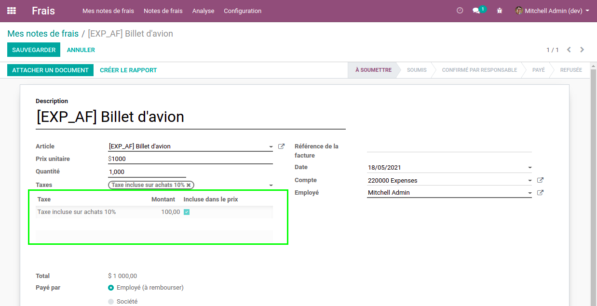
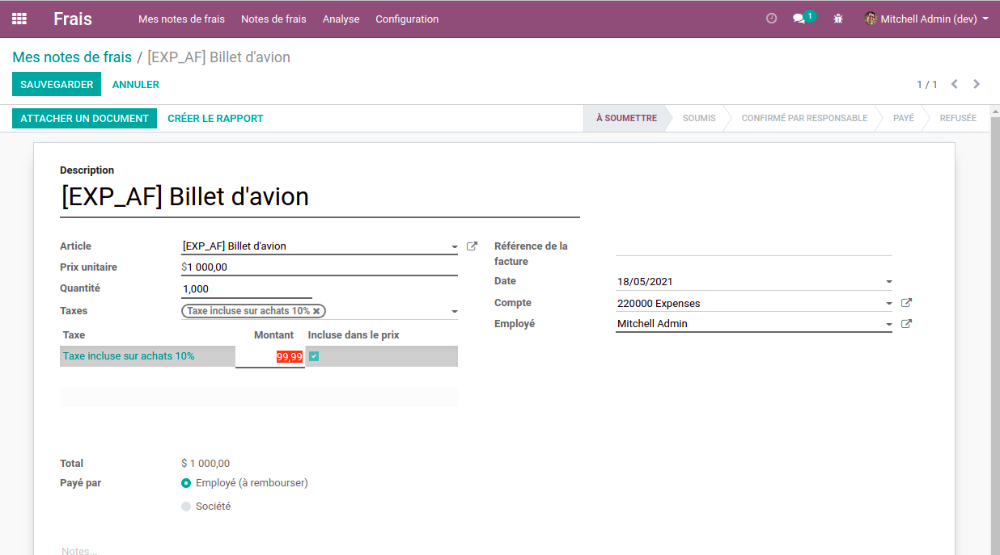

Expense Tax Adjustment
======================
This module adds a table of taxes below the unit price on expenses.
This allows the user to ajust the amounts of tax to match the taxes on the attachment.

When changing the price or quantity on the expense, the tax table is updated.
Then the user is able to ajust the amount.

The user can not add or remove any line from the tax table, nor change any field except the amount.

The total amount on the expense will be updated according to the tax amounts set on the table.

This module supports both taxes included and excluded from the price.

Contributors
------------
* Numigi (tm) and all its contributors (https://bit.ly/numigiens)

More information
----------------
* Meet us at https://bit.ly/numigi-com
