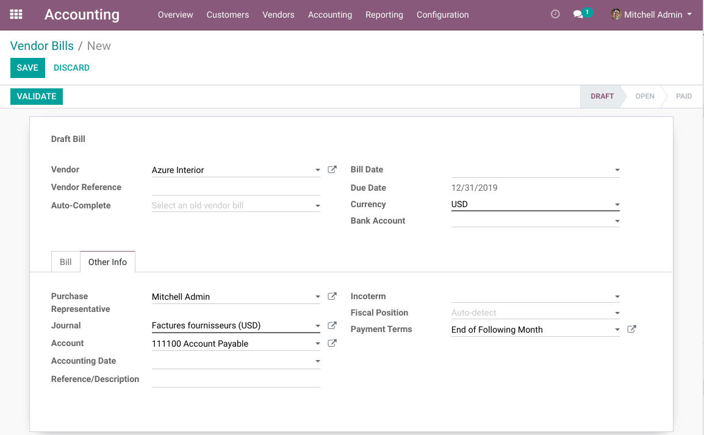
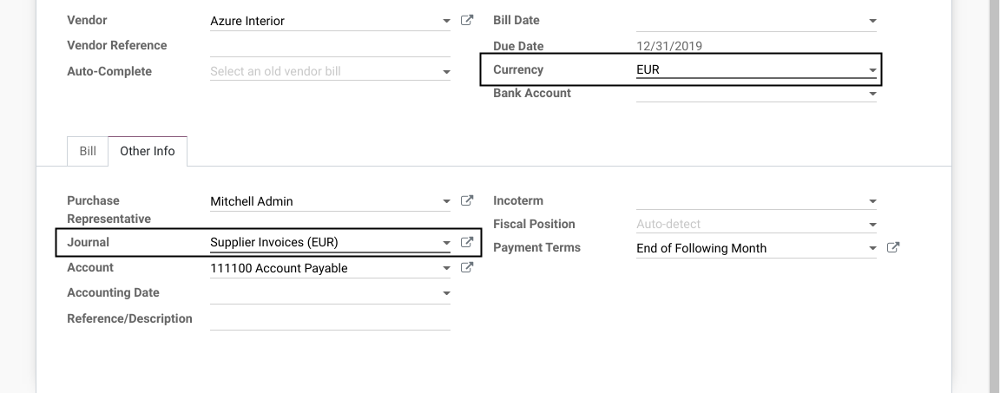
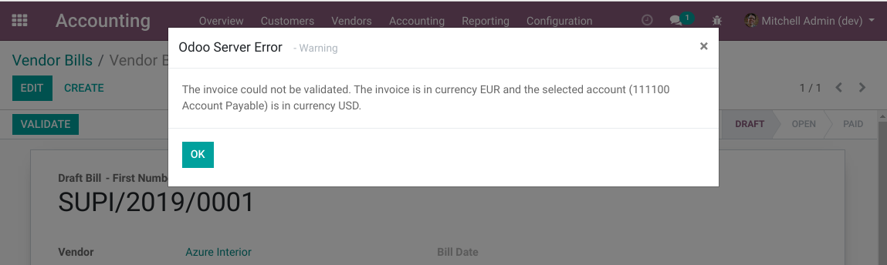
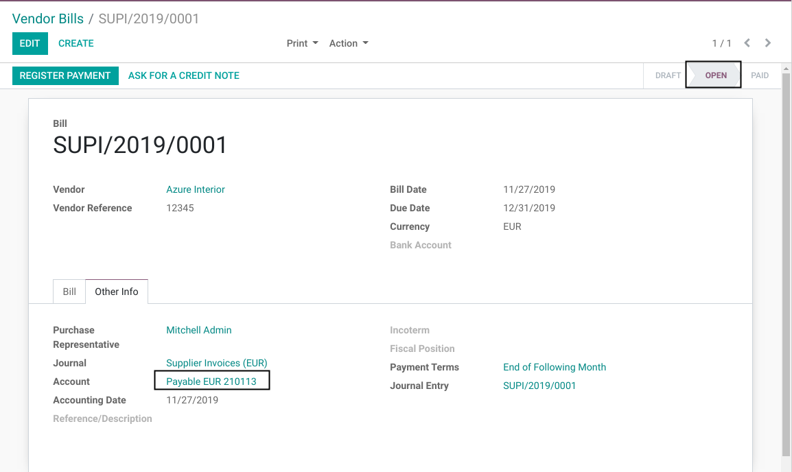

Invoice Currency Validation
===========================
This module adds validations on customer and supplier invoices.
It prevents the use of a payable/receivable account or journal that does not match the selected currency on the invoice.

.. contents:: Table of Contents

Context
-------
In Odoo, when selecting a journal on an invoice, the currency is updated.
However, when selecting a currency on an invoice, the journal is not updated.

This means, for example, that an invoice in a foreign currency can be posted in a journal of the company currency.

Because the journal is hidden in the ``Other Info`` tab, and not visible for all users,
this makes errors hard to prevent.

Usage
-----
As member of the group ``Accounting / User``, I go to the form view of a vendor bill.

I set the currency to ``EUR``.

I notice that the journal is set to a purchase journal in EUR.

The selected journal is the first journal found (in order of sequence) matching the following criterias:

* Matching the invoice currency.
* Matching the invoice company.
* Mathing the type of invoice (``Sale`` versus ``Purchase``).

If no matching journal is found, the ``Journal`` field is emptied on the invoice.

Constraint on Account
~~~~~~~~~~~~~~~~~~~~~
I notice that the payable account is not automatically adjusted when I change the currency.

When I validate, I notice a message error, telling me that the account does not match the invoice currency.

I manually change the account on the invoice. Then, I am able to validate the invoice.

The module will not decide for you which payable/receivable account to use given a specific currency.

Constraint on Journal
~~~~~~~~~~~~~~~~~~~~~
If for some reason, a user is able to create an invoice in a journal which does not match the invoice currency,
a blocking error message will be raised.

Contributors
------------
* Numigi (tm) and all its contributors (https://bit.ly/numigiens)
* Yasmine El Mrini (yasmine.elmrini@savoirfairelinux.com)
