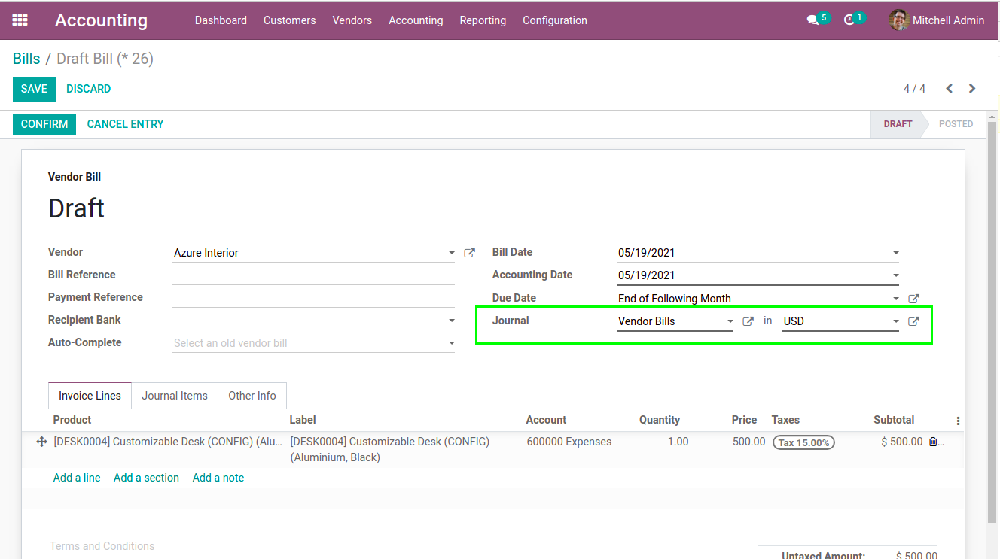
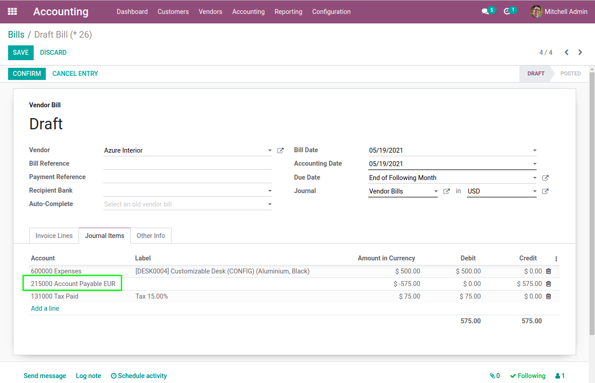
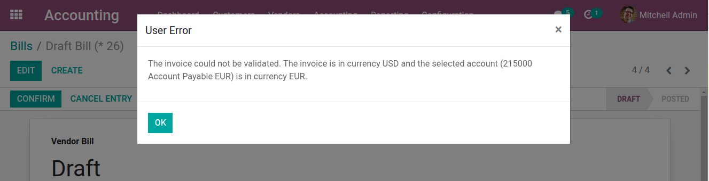

Invoice Currency Validation
===========================
This module adds validations on customer and supplier invoices.

It prevents the use of a journal or a partner account that does not match the selected currency on the invoice.

.. contents:: Table of Contents

Usage
-----
As member of the group ``Accounting / User``, I go to the form view of a vendor bill.

I select a journal in ``USD``.

Then, I go to the ``Journal Items`` tab and select a payable account in ``EUR``.

When I confirm the invoice, I get the following error message.

Contributors
------------
* Numigi (tm) and all its contributors (https://bit.ly/numigiens)
* Yasmine El Mrini (yasmine.elmrini@savoirfairelinux.com)
