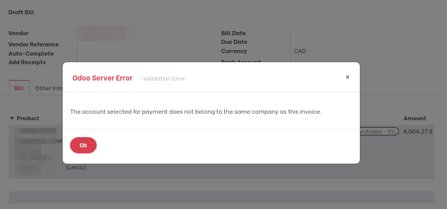
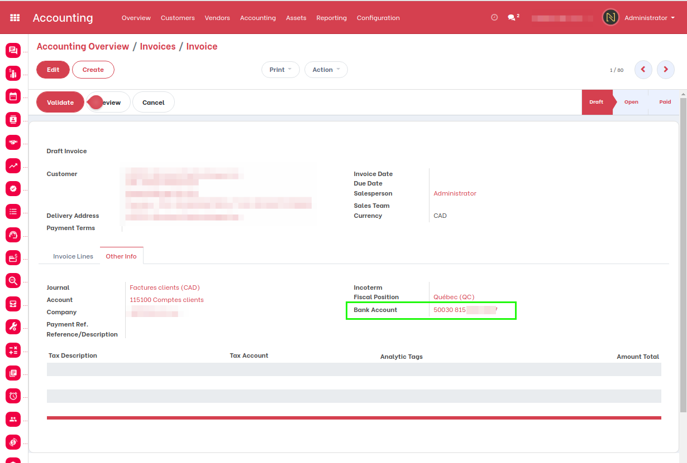

Invoice Intercompany Compatible
===============================

.. contents:: Table of Contents

Context
-------

The module `account_invoice_inter_company <https://github.com/OCA/multi-company/tree/12.0/account_invoice_inter_company>`_ allows to automatically generate the matching invoice in another company for intercompany sales and purchases.

Bank Accounts
-------------
When a purchase invoice is generated from a company A, the matching sale invoice is generated on the company B.

Because of a missing ``onchange`` function, the bank account of company A (the buyer) is set on the sale invoice,
instead of the bank account of company A.

When validating the purchase invoice, you get a blocking error message:

The above case happens if the superuser (OdooBot) is linked to the company A.

Solution
~~~~~~~~
After installing this module, the bank account of the selling company is properly set on the sale invoice.

Contributors
------------
* Numigi (tm) and all its contributors (https://bit.ly/numigiens)
