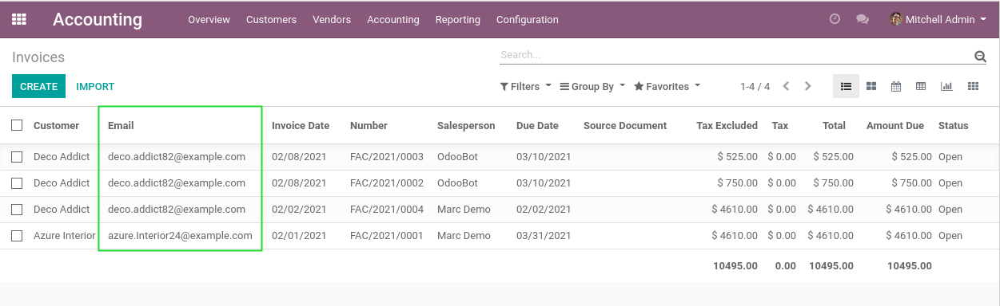

Invoice List Email
==================
This module adds the field ``Email`` in the list view of customer invoices.

This field is relevant when sending invoices in batch.

It helps to quickly verify the emails of the partners related to the invoices,
before sending the emails.

Contributors
------------
* Numigi (tm) and all its contributors (https://bit.ly/numigiens)
