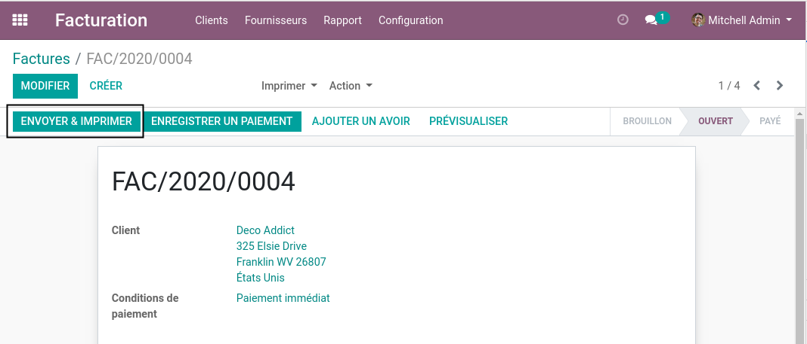
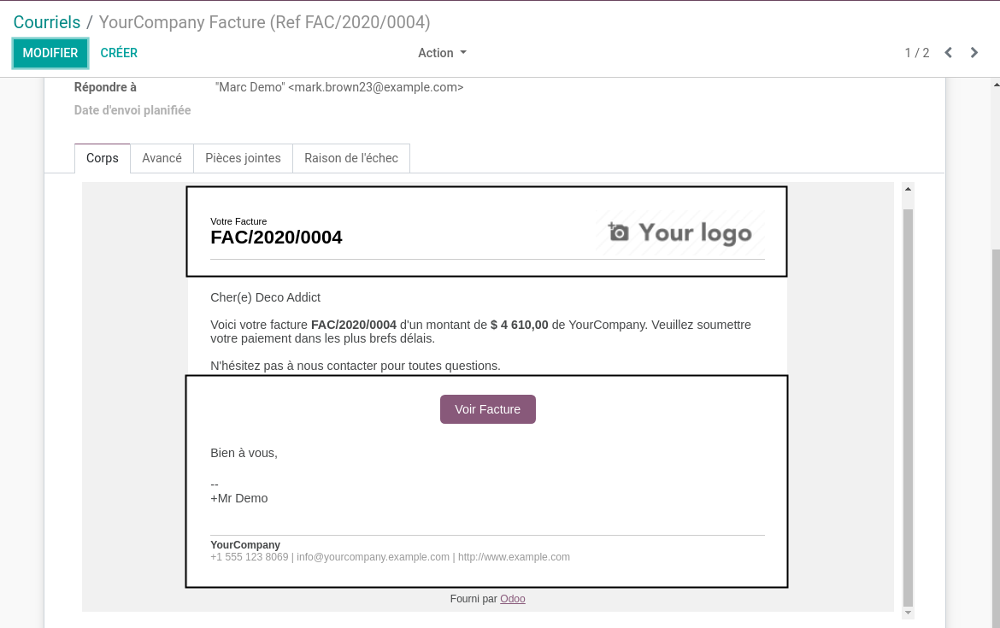
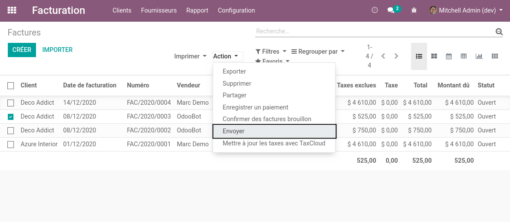
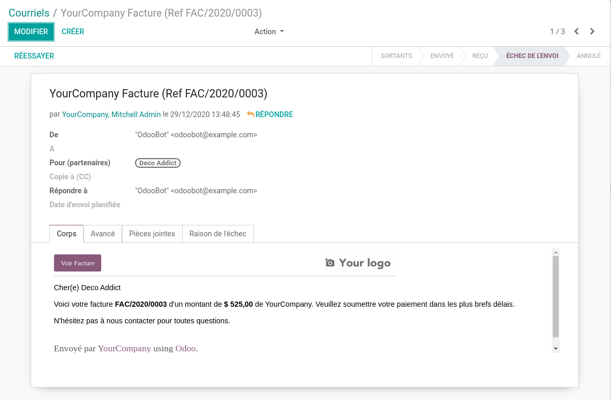

Invoice Mass Mailing With Layout
================================

.. contents:: Table of Contents

Context
-------
In vanilla Odoo, when sending an invoice from the ``Send && Print`` button,
the email is sent using a custom layout.

However, when sending the invoice using the mass mailing feature, the layout is not used.

Usage
-----
After installing this module, when sending the invoice using the mass mailing feature,
the email is sent using the custom layout.

Contributors
------------
* Numigi (tm) and all its contributors (https://bit.ly/numigiens)

More information
----------------
* Meet us at https://bit.ly/numigi-com
