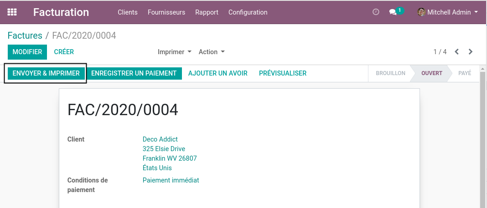
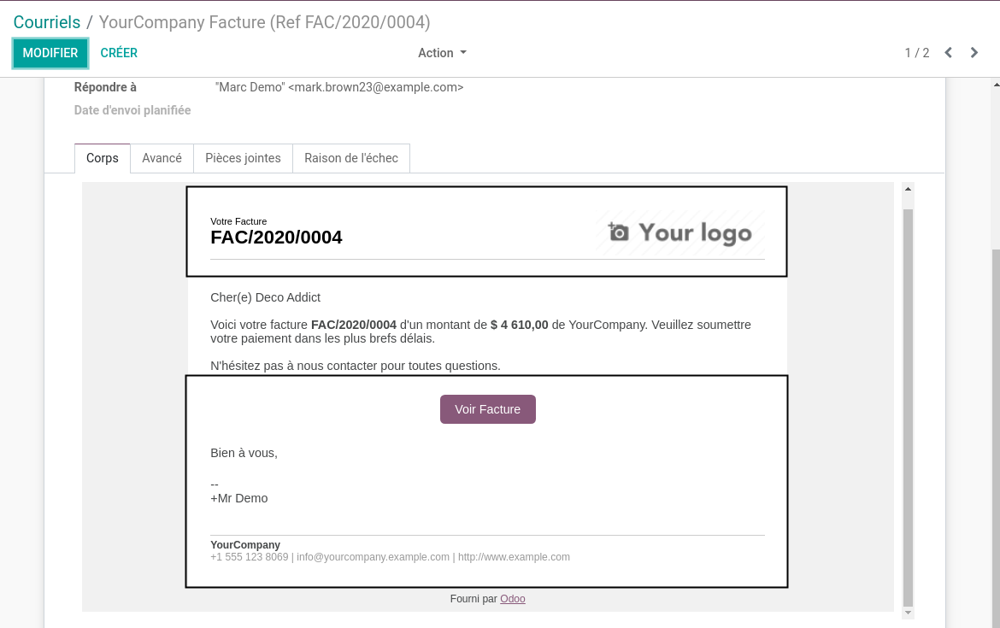
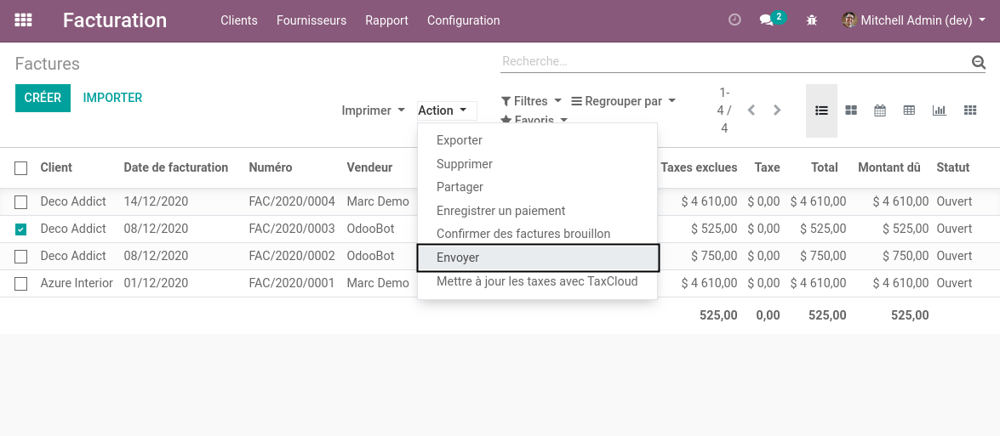
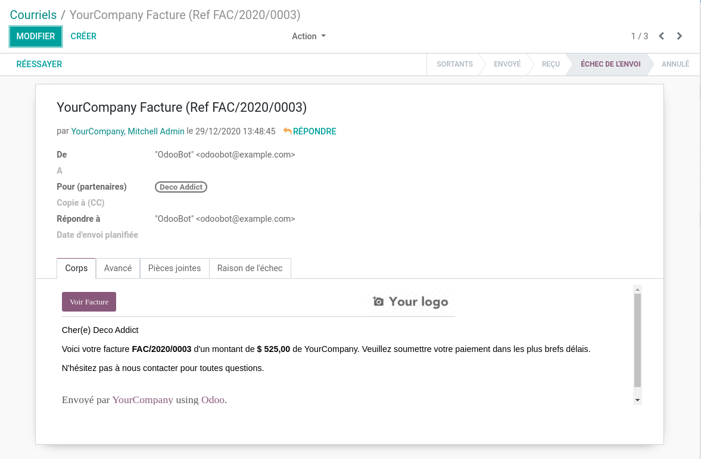

Invoice Mass Mailing With Layout
================================

.. contents:: Table of Contents

Context
-------
In vanilla Odoo, when sending an invoice from the ``Send && Print`` button,
the email is sent using a custom layout.

However, when sending the invoice using the mass mailing feature, the layout is not used.

Usage
-----
After installing this module, when sending the invoice using the mass mailing feature,
the email is sent using the custom layout.

Contributors
------------

The `Numigi <https://numigi.com/r/home>`_ team is the contributor to this project. We help Quebec companies implement Odoo and Konvergo ERP.

