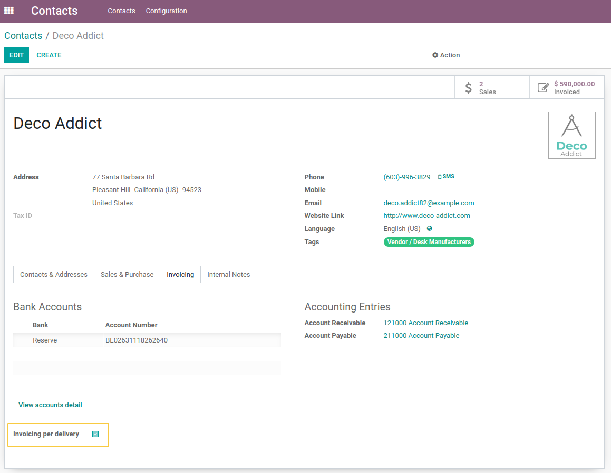
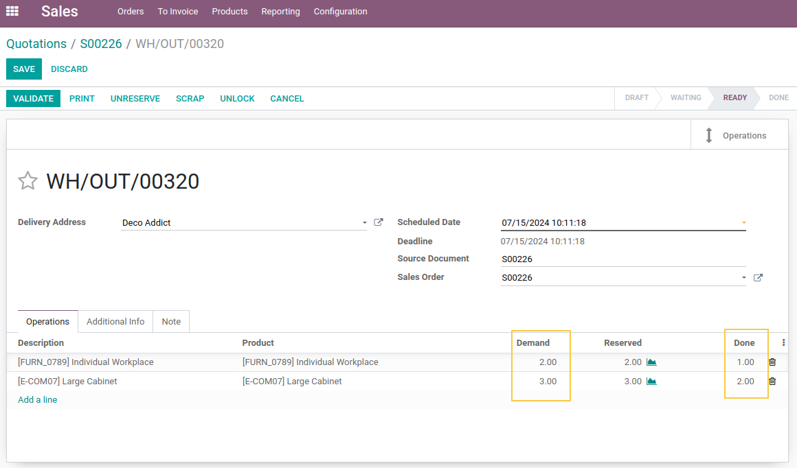
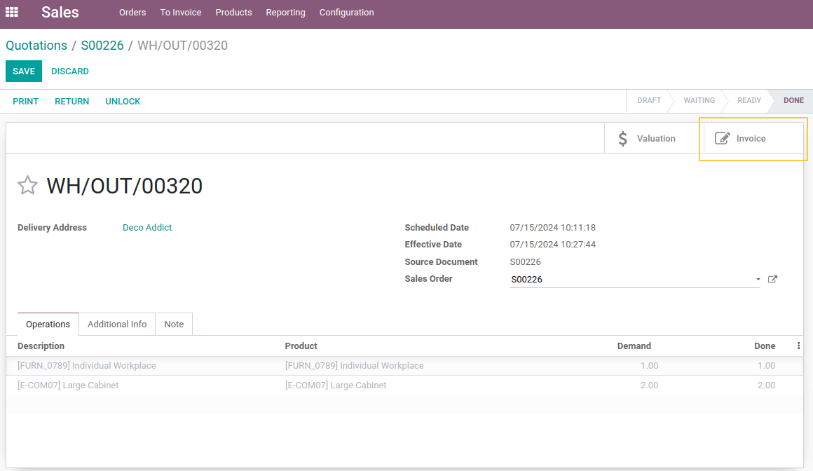
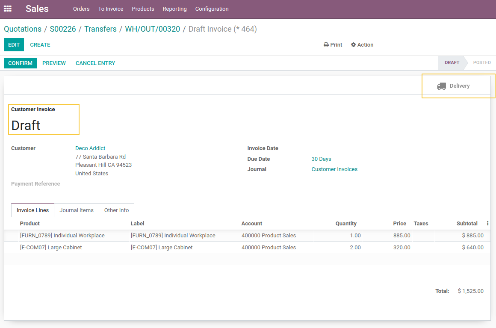
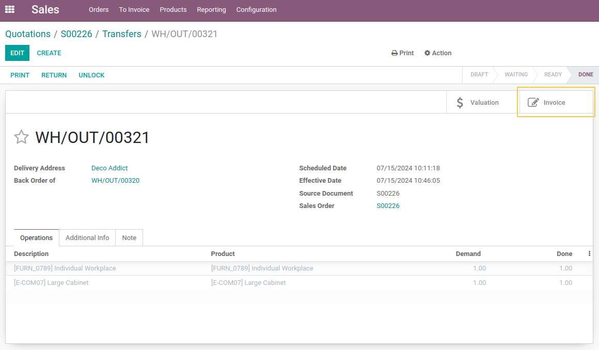
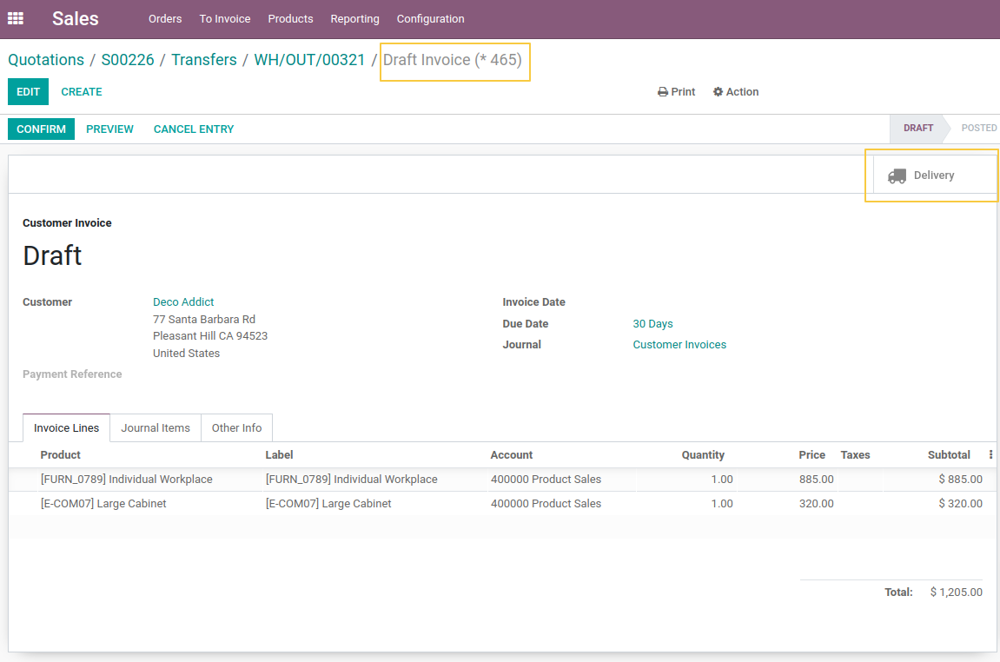
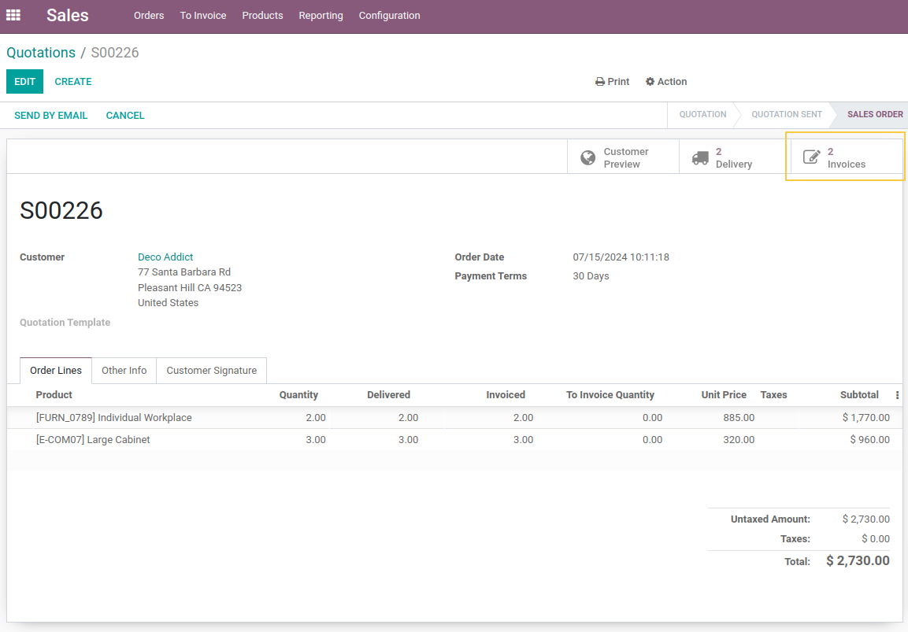
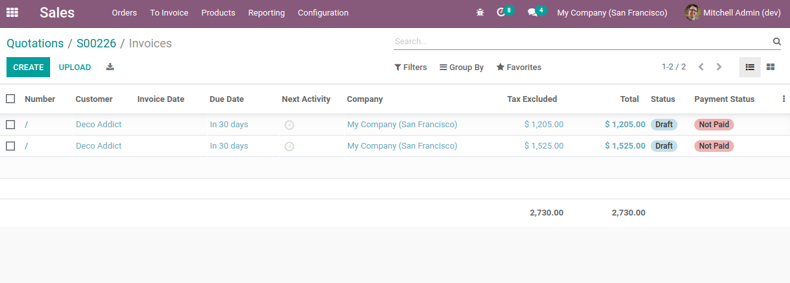

Invoice Per Delivery
====================
This module provides the possibility to create an invoice per delivery order for specific partners.

This module depends of the module `stock_picking_invoice_link <https://github.com/OCA/stock-logistics-workflow/tree/14.0/stock_picking_invoice_link>`_ to add a link between pickings and invoices as well as on the lines.

With this module, you can find back which deliveries an invoice relates to.

Note that the links are only for products with an invoicing policy set on delivery.

.. contents:: Table of Contents

Usage
-----

From a contact form view, you can now check the checkbox Invoicing per delivery
to generate an invoice for each delivery order of this client:

- Check the `Invoicing per delivery` box in your client form view.
- Create a sales order with 2 storable products for your client.
- Confirm the sales order to generate the delivery order.
- In your delivery order, set the quantity done lower than the demand to generate a backorder delivery order for your sales order.

- Validate your delivery order and then create a backorder for the remaining quantities. A smart button `Invoices` appears in the form view.

- Click on the smart button to see the draft `Invoices` created from the delivery order.
- You can go to the delivery order that generated this Invoice through the smart button `Pickins`

- Go back to your sales order, then go to the backorder delivery and validate the backorder.
- You will see that a new Invoice is created for this backorder.

- Return to your sales order to see that the 2 Invoices are linked to it.

Contributors
------------
* Numigi (tm) and all its contributors (https://bit.ly/numigiens)

More information
----------------
* Meet us at https://bit.ly/numigi-com
