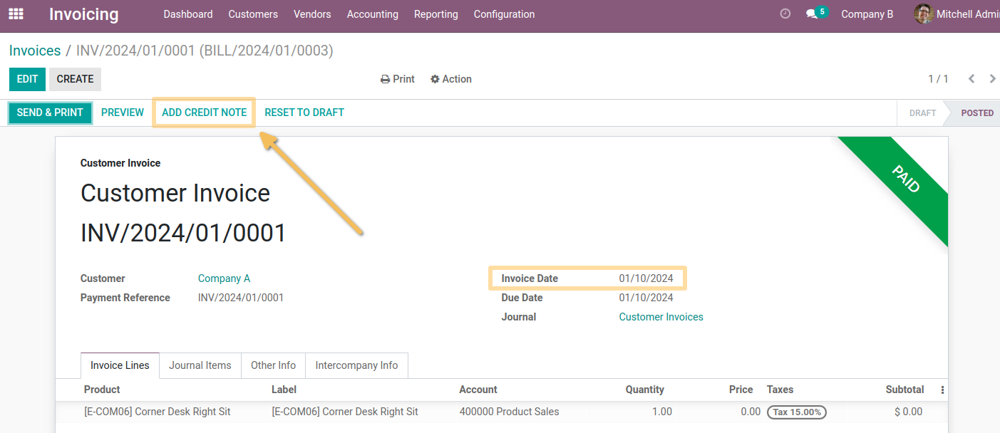
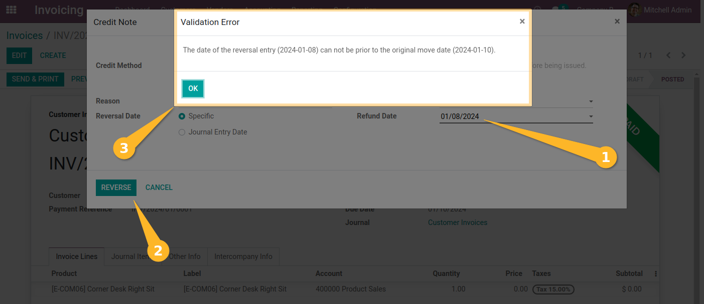
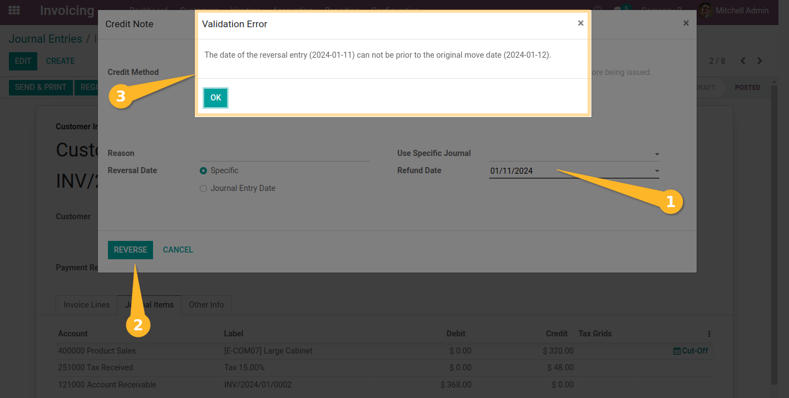

Invoice Refund Not Earlier
==========================
This module prevents to select a date prior to the invoice date when registering a refund.

This constraint is added on all journal entries, not only invoices.

Usage
-----
As member of the group `Accounting / Billing`, I go to the form view of an invoice:

I click `ADD CREDIT NOTE` to create a refund.

I select a refund date prior to the invoice date, then I click on ``Reverse``.
A blocking message appears:

Journal Entries
---------------
The equivalent constraint is also added when reversing a journal entry.

As member of the group Accounting / Billing, I go to the form view of a journal entry.

I click `ADD CREDIT NOTE` to create a reverse entry.

.. image:: static/description/jounal_entry_form_with_date.png

I select a date prior to the original move date. Then, I click on Reverse Moves.
A blocking message appears.

Contributors
------------
* Numigi (tm) and all its contributors (https://bit.ly/numigiens)
