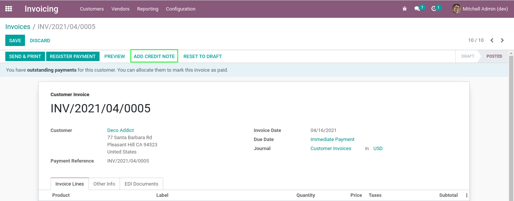

Invoice Refund Not Earlier
==========================
This module prevents to select a date prior to the invoice date when registering a refund.

This constraint is added on all journal entries, not only invoices.

Usage
-----
As member of the group `Accounting / Billing`, I go to the form view of an invoice:

I click to create a refund.

I select a refund date prior to the invoice date, then I click on ``Reverse``.

.. image:: static/description/refund_wizard.png

A blocking message appears:

.. image:: static/description/error_message.png

Contributors
------------
* Numigi (tm) and all its contributors (https://bit.ly/numigiens)
