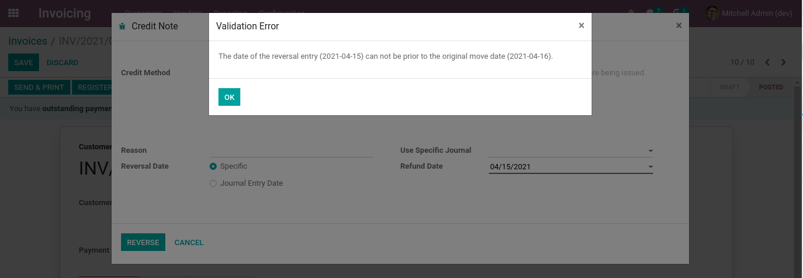

Invoice Refund Not Earlier
==========================
This module prevents to select a date prior to the invoice date when registering a refund.

This constraint is added for both supplier and customer invoices.

Usage
-----
As member of the group `Accounting / Billing`, I go to the form view of an invoice:

.. image:: static/description/invoice_form.png

I click to create a refund, then I select a refund date prior to the invoice date.

.. image:: static/description/refund_wizard.png

When I click on `Add Credit Note`, a blocking message appears:

The same message is raised if I select an accounting date prior to the invoice date.

Draft Refunds
-------------
If you choose to create a draft refund, the blocking message not appear when clicking on `Add Credit Note`.

.. image:: static/description/refund_wizard_draft.png

The constraint will be raised only when validating the refund.

.. image:: static/description/credit_note_validate_error_message.png

Journal Entries
---------------
The equivalent constraint is also added when reversing a journal entry.

As member of the group `Accounting / Billing`, I go to the form view of a journal entry.

I click on the `Reverse Entry` button.

.. image:: static/description/journal_entry_reverse_button.png

I select a date prior to the original move date. Then, I click on `Reverse Moves`.

.. image:: static/description/journal_entry_reverse_reverse_wizard.png

A blocking message appears.

.. image:: static/description/reversal_validate_error_message.png

Contributors
------------
* Numigi (tm) and all its contributors (https://bit.ly/numigiens)
