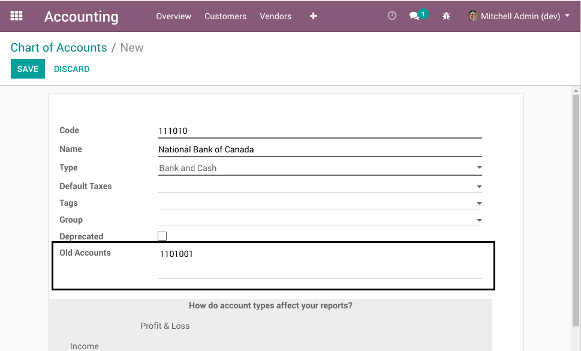

Old Accounts
============
This module adds a new field `Old Accounts` on the form view of accounts.

Its purpose is to allow users to enter old account numbers (i.e. ACCPAC) with their description as a
reference to the new Odoo account.

Contributors
------------

The `Numigi <https://numigi.com/r/home>`_ team is the contributor to this project. We help Quebec companies implement Odoo and Konvergo ERP.
