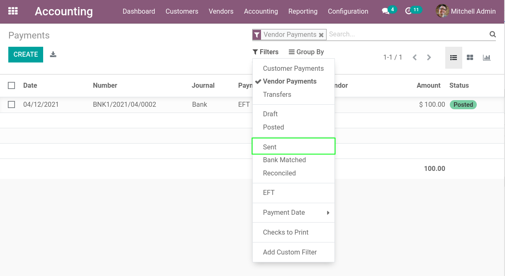
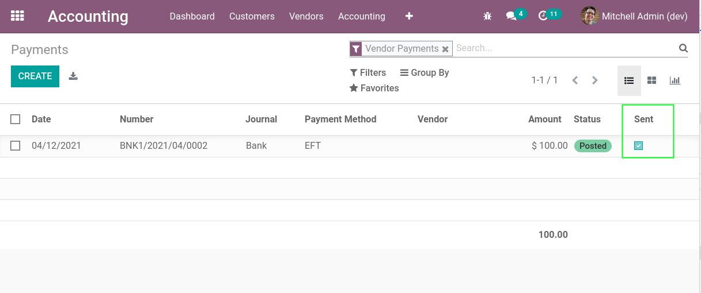
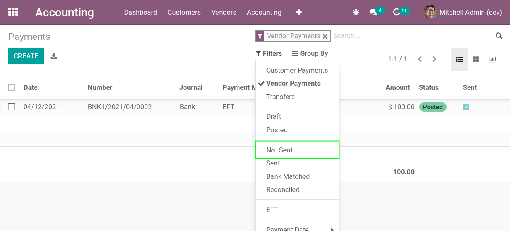

Payment List Not Sent
=====================

.. contents:: Table of Contents

Context
-------
In vanilla Odoo, in the list view of vendor payments, there is a filter for ``Sent`` payments.

However, for ``Not Sent`` payments, you must create a custom filter.

Overview
--------
After installing this module, I go to the list view of vendor payments.

I notice a new column ``Sent`` (the box is checked if the payment was sent to the vendor).

I also notice a filter ``Not Sent``, allowing to see only payments that are not sent.

Contributors
------------
* Numigi (tm) and all its contributors (https://bit.ly/numigiens)
