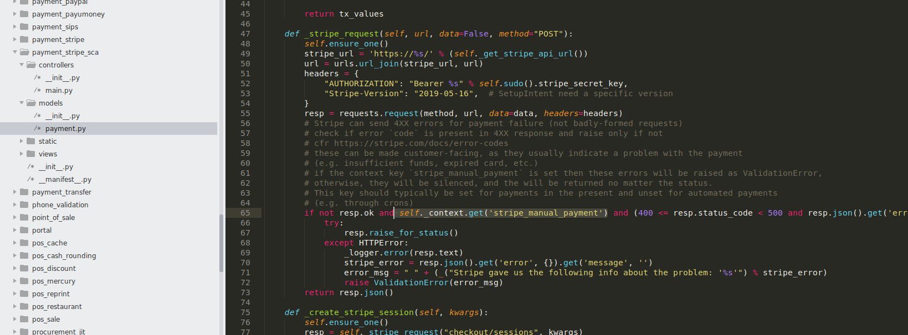

Payment Stripe Not Slienced
===========================

Context
-------
As of Odoo 14.0, when an error happens in a request to stripe,
the error is silenced by default.

This makes the errors caused by the stripe module very hard to diagnose.

Overview
--------
When this module is installed, the errors caused by the Stripe API are not silenced.

Contributors
------------
* Numigi (tm) and all its contributors (https://bit.ly/numigiens)

More information
----------------
* Meet us at https://bit.ly/numigi-com
