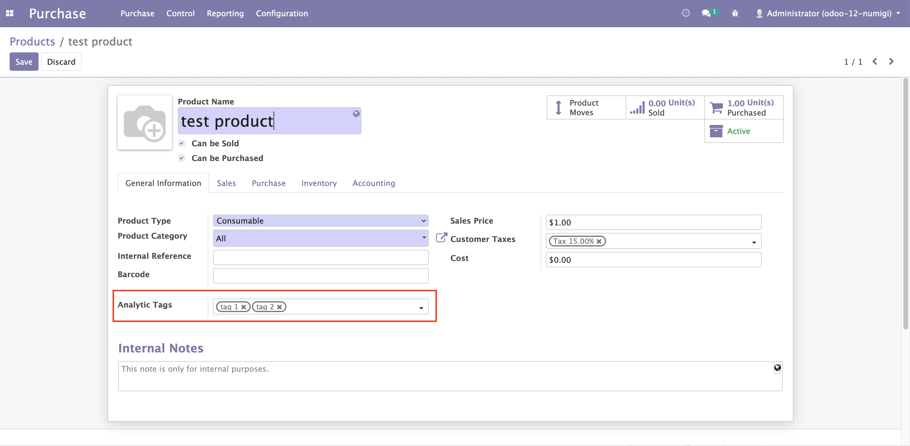
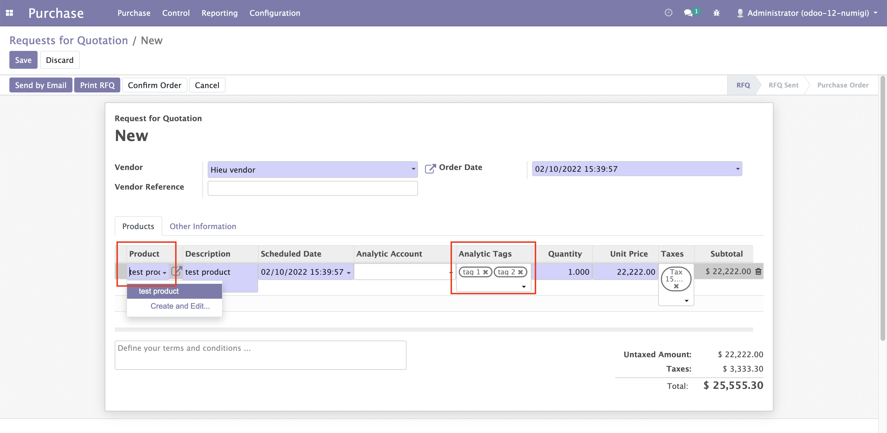
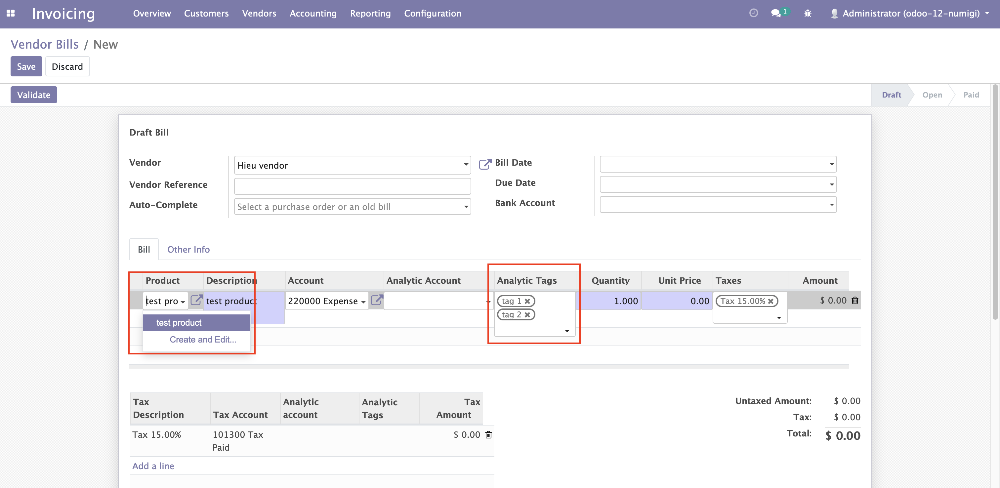

Purchase Default Analytic Tag
=============================
Description
-----------

This module will add Analytic Tags on Product form which can only be accessed by group Technical Settings / Analytic Accounting Tags

On Purchase Order Line, when Product is selected, Analytic Tags will be populated from Analytic Tags of selected product

On Account Invoice Line, when Product is selected, Analytic Tags will be populated from Analytic Tags of selected product

Configuration
-------------

No configuration required apart from module installation.

Contributors
------------
* Numigi (tm) and all its contributors (https://bit.ly/numigiens)
* Komit (https://komit-consulting.com)

More information
----------------
* Meet us at https://bit.ly/numigi-com
